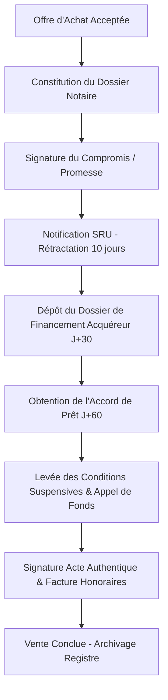

# SPÉCIFICATION MODULE 01 : PIPELINE NOTAIRE & SUIVI TRANSACTIONNEL
## DU COMPROMIS DE VENTE À L'ACTE AUTHENTIQUE

---

## 1. OBJECTIFS DU MODULE
1. **Éliminer les risques de caducité de vente** en suivant automatiquement les dates butoirs légales (délai de rétractation SRU, date de dépôt de dossier de prêt, date d'accord de prêt, date de réitération chez le notaire).
2. **Centraliser le dossier notarial** : Pièces administratives (Titre de propriété, Taxe foncière, Diagnostics techniques, Carnet d'information du logement, Règlement de copropriété, Pré-état daté si applicable).
3. **Automatiser la facturation d'honoraires** : Génération de la note d'honoraires officielle envoyée au notaire instrumentaire pour encaissement immédiat le jour de la signature de l'acte authentique.

---

## 2. MACHINE D'ÉTAT DU PROCESSUS TRANSACTIONNEL



---

## 3. MODÈLE DE DONNÉES & TABLES (SUPABASE / POSTGRESQL)

```sql
CREATE TABLE transaction_deals (
    id UUID PRIMARY KEY DEFAULT gen_random_uuid(),
    property_id UUID REFERENCES properties(id) ON DELETE CASCADE,
    buyer_id UUID REFERENCES buyers(id) ON DELETE SET NULL,
    
    -- Statut du cycle de vente
    status VARCHAR(50) DEFAULT 'offre_acceptee', -- 'offre_acceptee', 'compromis_en_cours', 'compromis_signe', 'delai_sru_en_cours', 'sru_purgee', 'attente_pret', 'pret_accorde', 'acte_planifie', 'acte_signe', 'annule'
    
    -- Montants financiers
    offer_price_fai NUMERIC NOT NULL,
    offer_price_net NUMERIC NOT NULL,
    agency_fees_amount NUMERIC NOT NULL,
    deposit_amount NUMERIC DEFAULT 0, -- Montant du séquestre (5% ou 10%)
    deposit_holder VARCHAR(100) DEFAULT 'Notaire Vendeur', -- 'Notaire Vendeur', 'Notaire Acquéreur', 'Séquestre GALIAN'
    
    -- Notaires
    seller_notary_name VARCHAR(255),
    seller_notary_email VARCHAR(255),
    seller_notary_phone VARCHAR(50),
    seller_notary_office VARCHAR(255), -- Ex: Étude Notariale de Pélissanne (Me ...)
    
    buyer_notary_name VARCHAR(255),
    buyer_notary_email VARCHAR(255),
    buyer_notary_phone VARCHAR(50),
    buyer_notary_office VARCHAR(255),
    
    -- Calendrier légal & Jalons
    offer_date DATE NOT NULL,
    compromis_date DATE,
    sru_notification_date DATE,
    sru_expiry_date DATE, -- Calcul automatique : sru_notification_date + 10 jours ouvrés
    loan_application_deadline DATE, -- Dépôt de dossier (généralement J+30)
    loan_approval_deadline DATE, -- Obtention du prêt (généralement J+45 ou J+60)
    final_deed_target_date DATE, -- Date prévisionnelle de l'acte authentique
    actual_closing_date DATE, -- Date réelle de signature
    
    -- Financement
    loan_amount_requested NUMERIC,
    loan_interest_rate_max NUMERIC(4,2),
    loan_duration_years INT,
    loan_bank_name VARCHAR(255),
    broker_name VARCHAR(255),
    
    -- Pièces & Documents joints
    checklist_documents JSONB DEFAULT '{
        "titre_propriete": false,
        "taxe_fonciere": false,
        "dossier_diagnostics": false,
        "pre_etat_date": false,
        "reglement_copro": false,
        "carte_identite_vendeur": false,
        "carte_identite_acquereur": false,
        "justificatif_domicile": false,
        "simulation_pret": false,
        "offre_achat_signee": false
    }'::jsonb,
    
    -- Facturation & Honoraires
    invoice_number VARCHAR(50),
    invoice_date DATE,
    invoice_sent_to_notary BOOLEAN DEFAULT false,
    fees_received BOOLEAN DEFAULT false,
    
    notes TEXT,
    created_at TIMESTAMP WITH TIME ZONE DEFAULT timezone('utc'::text, now()),
    updated_at TIMESTAMP WITH TIME ZONE DEFAULT timezone('utc'::text, now())
);
```

---

## 4. INTERFACE UTILISATEUR & ERGONOMIE DU COCKPIT

### 4.1. Vue Kanban "Pipeline des Ventes en Cours"
- Colonnes dynamiques :
  1. **Offres Validées** (En attente de rédaction du compromis).
  2. **Compromis Signés / Délai SRU (10j)** : Compteur de jours restants avec badge vert/orange/rouge.
  3. **Suivi Financement (45-60j)** : Alerte automatique à J-15 de la date limite d'accord de prêt pour relancer l'acquéreur ou son courtier.
  4. **Prêts Accordés / En attente d'Acte** : Date fixée chez le notaire instrumentaire.
  5. **Ventes Clôturées** : Factures émises et honoraires encaissés.

### 4.2. Générateur de Facture d'Honoraires en 1 Clic
- En-tête officiel de la **SASU Nell'Immo** (RCS Salon n° 853 807 006, Carte CPI 1310 2019 000 042 974, Garantie GALIAN).
- Rapprochement automatique du numéro de mandat et de l'acte authentique.
- Envoi automatique par email au notaire avec RIB de l'agence joint.

### 4.3. Alertes Automatiques par SMS / WhatsApp
- **J-10 avant échéance de prêt** : Message WhatsApp pré-formaté à l'acquéreur :  
  *« Bonjour Thomas, un point d'étape sur votre dossier de prêt pour la maison de Pélissanne. Avez-vous reçu l'accord de principe de la banque ? Le notaire Me ... attend l'attestation avant le [Date]. Bien à vous, Nelly Fernandez. »*
