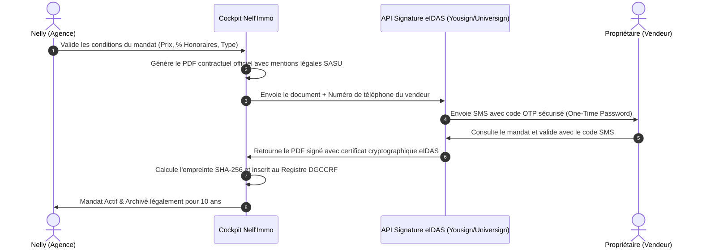

# SPÉCIFICATION MODULE 03 : CONTRATS & SIGNATURE ÉLECTRONIQUE LÉGALE
## GÉNÉRATION DE MANDATS LOI HOGUET & SIGNATURE CERTIFIÉE eIDAS

---

## 1. OBJECTIFS DU MODULE
1. **Remplacer les formulaires papier et carnets de mandats** par un générateur PDF contractuel conforme à la réglementation en vigueur (Loi Hoguet, Loi ALUR, Loi Climat et Résilience, Code de la consommation pour le démarchage à domicile).
2. **Permettre la signature à distance en 1 clic** (par SMS et Email) via une passerelle de signature électronique reconnue (eIDAS) ainsi que la signature en face-à-face sur tablette ou smartphone.
3. **Alimenter automatiquement le Registre Officiel des Mandats** sans aucune double saisie.

---

## 2. TYPES DE DOCUMENTS CONTRACTUELS GÉRÉS

| Document | Cadre Juridique | Clauses Clés Intégrées |
| :--- | :--- | :--- |
| **Mandat de Vente Exclusif** | Loi Hoguet Art. 6 / Décret 72-678 | Clause d'exclusivité, durée irrévocable (3 mois), tacite reconduction limitée, barème d'honoraires TTC, clause pénale, obligation de compte-rendu. |
| **Mandat de Vente Simple** | Loi Hoguet Art. 6 | Faculté pour le mandant de vendre par lui-même ou par un tiers, déclaration obligatoire des acquéreurs présentés. |
| **Avenant de Modification de Prix** | Loi Hoguet | Modification du prix FAI et du net vendeur avec recalcul immédiat des honoraires, date d'effet immédiate. |
| **Offre d'Achat (Acte Unilatéral)** | Code Civil Art. 1113 | Montant proposé, durée de validité de l'offre (ex: 7 jours), conditions suspensives de prêt et d'urbanisme, interdiction de versement d'argent préalable (Loi Hoguet Art. 1591). |
| **Bon de Visite Certifié** | Jurisprudence Cour de Cassation | Reconnaissance de visite, engagement de non-contournement de l'agence, horodatage UTC et géolocalisation IP. |

---

## 3. WORKFLOW DE SIGNATURE ÉLECTRONIQUE SÉCURISÉE

---

## 4. CLAUSES OBLIGATOIRES INTÉGRÉES DANS LE GABARIT PDF

1. **Identification de la SASU NELL'IMMO** :
   - Capital social : 2 000 €, RCS Salon-de-Provence 853 807 006.
   - Carte Professionnelle Transaction n° CPI 1310 2019 000 042 974 délivrée par la CCI Marseille Provence.
   - Garantie Financière GALIAN (89 rue La Boétie, 75008 Paris).
   - Assurance Responsabilité Civile Professionnelle MMA Entreprise.
   - Adhérent FNAIM avec médiateur de la consommation agréé.
2. **Droit de Rétractation (Mandat Hors Établissement)** :
   - Formulaire détachable de rétractation de 14 jours conforme aux articles L. 221-18 et suivants du Code de la consommation.
   - Option de renonciation expresse au délai de rétractation pour exécution immédiate de la commercialisation.
3. **Médiation de la Consommation (Obligation DGCCRF)** :
   - Mention du médiateur FNAIM et de son site internet de saisine.
4. **Tracfin & Lutte contre le Blanchiment** :
   - Mention de l'obligation d'identification des bénéficiaires effectifs.
