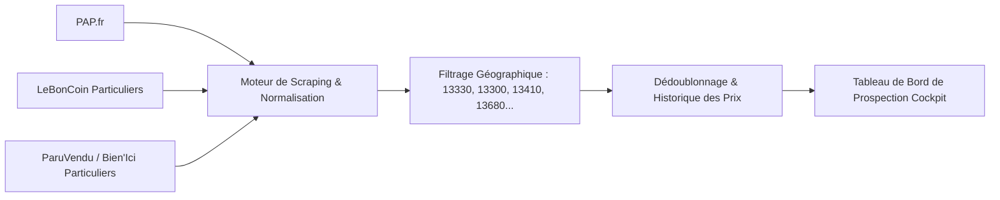

# SPÉCIFICATION MODULE 05 : PIGE IMMOBILIÈRE & PROSPECTION VENDEURS
## CAPTATION DE NOUVEAUX MANDATS EXCLUSIFS EN PAYS SALONAIS

---

## 1. OBJECTIFS DU MODULE
1. **Détecter les biens mis en vente par des particuliers (PAP, LeBonCoin)** avant la concurrence sur Pélissanne, Salon-de-Provence, Lambesc, Aurons, Lançon, La Barben et communes voisines.
2. **Historiser les baisses de prix** : Repérer les vendeurs particuliers qui galèrent depuis 60+ jours et qui sont mûrs pour confier un mandat exclusif à Nelly.
3. **Fournir un argumentaire comparatif DVF instantané** pour transformer l'appel de pige en rendez-vous d'estimation au domicile du vendeur.

---

## 2. SOURCES DE VEILLE & RADAR D'ANNONCES



---

## 3. FONCTIONNALITÉS CLÉS POUR L'AGENT

### 3.1. Tableau de Pige Interactif
- **Filtres rapides** : Par commune, tranche de prix, type de bien (Maison, Terrain, Appartement) et ancienneté de l'annonce.
- **Indicateur de fatigue de l'annonce** :
  - 🟢 *Nouveau (< 48h)* : Premier contact de courtoisie.
  - 🟡 *En vente depuis 30 à 60 jours* : Vendeur qui commence à douter de sa stratégie.
  - 🔴 *En vente depuis > 90 jours ou avec baisse de prix constatée* : Vendeur prêt à signer un mandat exclusif avec une agence reconnue.

### 3.2. Fiche Prospect avec Argumentaire DVF Intégré
- Dès qu'un bien est ouvert dans le module de pige :
  - L'application calcule automatiquement les **ventes réelles notariées DVF dans un rayon de 500m**.
  - Elle affiche l'écart entre le prix demandé par le particulier et le prix réel du marché.
  - Un bouton **"Lancer l'appel"** déclenche l'appel sur smartphone.
  - Un bouton **"Script Téléphonique Nelly"** affiche l'accroche éprouvée :  
    *« Bonjour, je vous appelle concernant votre maison en vente à Pélissanne. J'ai actuellement 2 acquéreurs en recherche active avec financement validé dans votre quartier... »*

### 3.3. Suivi de la Prospection Terrain (Boîtage & Porte-à-Porte)
- Carnet de prospection par quartier (ex: *Quartier des Enjouvènes*, *Les Costes*, *Les Viougues*).
- Statuts de contact : `À contacter`, `Refus`, `Rappel programmé`, `RDV Estimation Obtenu`, `Mandat Signé`.

---

## 4. MODÈLE DE DONNÉES

```sql
CREATE TABLE prospecting_leads (
    id UUID PRIMARY KEY DEFAULT gen_random_uuid(),
    source VARCHAR(50) NOT NULL, -- 'leboncoin', 'pap', 'boitage', 'bouche_a_oreille', 'recommandation'
    source_url TEXT,
    
    title VARCHAR(255) NOT NULL,
    property_type VARCHAR(50) DEFAULT 'maison',
    city VARCHAR(100) NOT NULL,
    postal_code VARCHAR(10) NOT NULL,
    price_asked NUMERIC NOT NULL,
    initial_price NUMERIC, -- Pour tracer les baisses
    price_drops_count INT DEFAULT 0,
    
    surface NUMERIC,
    rooms_count INT,
    description TEXT,
    photos_urls TEXT[],
    
    -- Coordonnées vendeur détectées
    seller_name VARCHAR(255),
    seller_phone VARCHAR(50),
    seller_email VARCHAR(255),
    
    -- Suivi de l'agent
    status VARCHAR(50) DEFAULT 'nouveau', -- 'nouveau', 'a_rappeler', 'rdv_pris', 'refus_agent', 'deja_vendu', 'mandat_obtenu'
    call_attempts_count INT DEFAULT 0,
    last_contacted_at TIMESTAMP WITH TIME ZONE,
    next_followup_date DATE,
    notes TEXT,
    
    created_at TIMESTAMP WITH TIME ZONE DEFAULT timezone('utc'::text, now())
);
```
