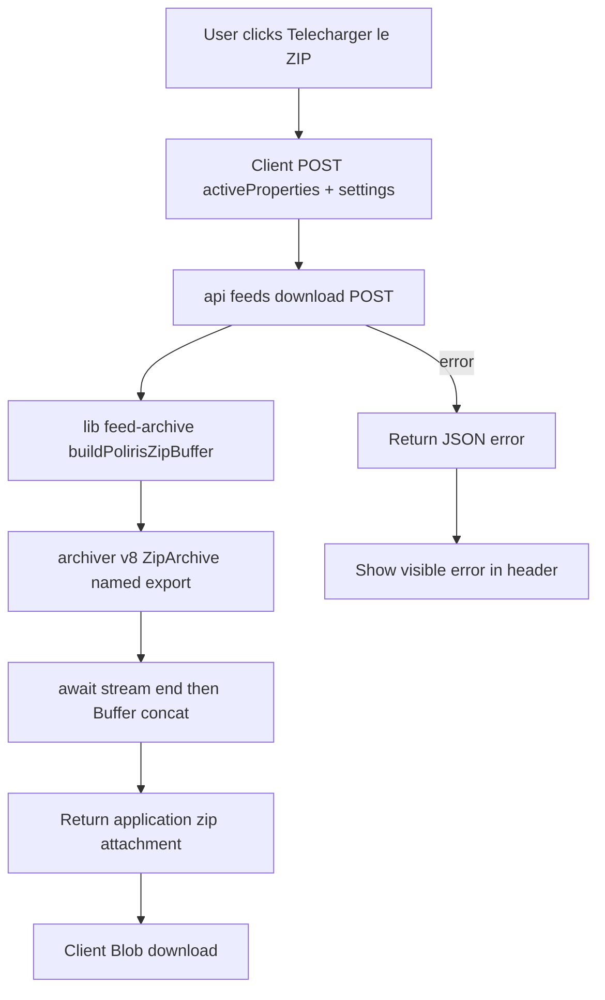

# Fix — Multi-diffusion : téléchargement ZIP & statut des canaux

**Scope:** diffusion page only. Focus: make the page actually work.
**Type:** Implementation plan (no code written yet).

---

## Root causes

### 1. ZIP download fails (HTTP 503)

- Button: [`DiffusionHeader.tsx`](../components/cockpit/diffusion/DiffusionHeader.tsx:29) is a plain `<a href="/api/feeds/download?feed=poliris" download>`.
- Proxy: [`app/api/feeds/download/route.ts`](../app/api/feeds/download/route.ts:20) forwards to `/api/feeds/seloger-poliris`.
- Data: [`app/api/feeds/seloger-poliris/route.ts`](../app/api/feeds/seloger-poliris/route.ts:18) calls [`resolveFeedData()`](../lib/feed-data.ts:42).
- [`resolveFeedData()`](../lib/feed-data.ts:43) returns `live: false` when Supabase is not configured. There is **no `.env`**, so `isSupabaseConfigured()` is `false`.
- Result: route returns **503 plain text**; browser shows a text error page, no ZIP.

The app runs on **localStorage** ([`lib/store.tsx`](../lib/store.tsx:174)), so the real listings never reach the server. The server correctly refuses demo data, but that makes the download impossible in a local-first setup.

### 2. Archiver v8 misuse (would break even with live data)

- [`app/api/feeds/seloger-poliris/route.ts`](../app/api/feeds/seloger-poliris/route.ts:32) assumes a default/callable export.
- `archiver@8.0.0` is **ESM-only** and exports named classes `{ Archiver, ZipArchive, TarArchive, JsonArchive }` — no default export, no callable function.
- The fallback `typeof mod === 'function' ? mod('zip', ...)` throws.
- [`archive.finalize()`](../app/api/feeds/seloger-poliris/route.ts:54) is awaited but the code never waits for the stream `end` event, so `Buffer.concat(chunks)` may run before all chunks flush → truncated ZIP.

### 3. Channel status always green

- [`ChannelsStatusGrid.tsx`](../components/cockpit/diffusion/ChannelsStatusGrid.tsx:92) renders a hardcoded `bg-emerald-500` dot on every channel regardless of configuration.

---

## Fix strategy

Make the download **client-driven**: POST the same `activeProperties` + `settings` the page already holds to the download route, which builds the ZIP server-side. Works with or without Supabase, and preserves the no-demo-data guarantee because the payload comes from the user's own live session.

---

## Steps

### Step 1 — New helper `lib/feed-archive.ts`

Create `buildPolirisZipBuffer(properties: Property[], settings: AgencySettings): Promise<Buffer>`.

- Import the named export: `const { ZipArchive } = await import('archiver');`
- Instantiate `new ZipArchive({ zlib: { level: 9 } })`.
- Append `annonces.csv`, `photos.cfg`, `config.txt` using the existing generators in [`lib/poliris.ts`](../lib/poliris.ts:32).
- Collect chunks via `archive.on('data', ...)`.
- **Await the `end` event** (wrap in a Promise) before `Buffer.concat(chunks)`.
- Reject on `archive.on('error', ...)`.
- Use `settings.seloger_agency_code` for the agency code.

### Step 2 — Refactor `app/api/feeds/seloger-poliris/route.ts`

- Replace the inline archiver block with a call to `buildPolirisZipBuffer(source.properties, source.settings)`.
- Keep the token check and the fail-closed `resolveFeedData()` behaviour for the GET (public portal feed) path.

### Step 3 — Add POST to `app/api/feeds/download/route.ts`

- Add `export async function POST(request: NextRequest)`.
- Read `{ properties, settings }` from the JSON body.
- If `feed === 'poliris'` (or default), call `buildPolirisZipBuffer` and return the ZIP with `Content-Disposition: attachment; filename="import_nellimo_poliris.zip"`.
- Validate the payload; return **JSON** errors (`{ error: string }`) with proper status codes instead of plain text.
- Keep the existing GET as a live-Supabase fallback, but change its error responses to JSON too.

### Step 4 — Client download handler in `DiffusionHeader.tsx`

- Add props: `onDownloadZip: () => void` and `isDownloading: boolean`.
- Replace the `<a href>` with a `<button onClick={onDownloadZip}>`.
- Show a spinner/label while downloading.

### Step 5 — Wire handler in `app/cockpit/diffusion/page.tsx`

- Add `handleDownloadZip` that:
  - `fetch('/api/feeds/download?feed=poliris', { method: 'POST', body: JSON.stringify({ properties: activeProperties, settings }) })`.
  - On `!res.ok`, read the JSON error and surface it (e.g. set an error state shown near the header).
  - On success, `res.blob()` → `URL.createObjectURL` → temporary `<a download>` click → `revokeObjectURL`.
- Add `isDownloading` and `downloadError` state; pass to `DiffusionHeader`.

### Step 6 — Real channel status in `ChannelsStatusGrid.tsx`

- Derive status per channel from `settings`:
  - SeLoger: configured if `settings.seloger_agency_code` present.
  - LeBonCoin: configured if `settings.leboncoin_sftp_host` present.
  - Bien'ici: configured if agency code present.
  - Figaro / Green-Acres: not configured unless a corresponding setting exists.
  - Facebook: configured if `settings.instagram_business_id` (or equivalent) present.
- Render green when configured, amber when partially configured, red/grey when not, with a short reason label.
- Keep the existing download links for the channels that have them.

### Step 7 — Manual verification

- Click **Télécharger le ZIP**.
- Confirm a valid `import_nellimo_poliris.zip` downloads.
- Open it and confirm it contains `annonces.csv`, `photos.cfg`, `config.txt`.
- Confirm the channel dots reflect real configuration.

---

## Files touched

| File | Change |
| --- | --- |
| `lib/feed-archive.ts` | New — shared ZIP builder |
| `app/api/feeds/seloger-poliris/route.ts` | Use shared builder, drop broken archiver code |
| `app/api/feeds/download/route.ts` | Add POST, JSON errors |
| `components/cockpit/diffusion/DiffusionHeader.tsx` | Button + loading state |
| `app/cockpit/diffusion/page.tsx` | Download handler + error state |
| `components/cockpit/diffusion/ChannelsStatusGrid.tsx` | Real per-channel status |

---

## Out of scope (tracked separately)

- SFTP deposit is not wired (cron only reports `not_configured`).
- Meta publish is a simulated delay.
- Social planner is localStorage-only.
- Hardcoded agency identity in copywriting/flyers/social generators.
