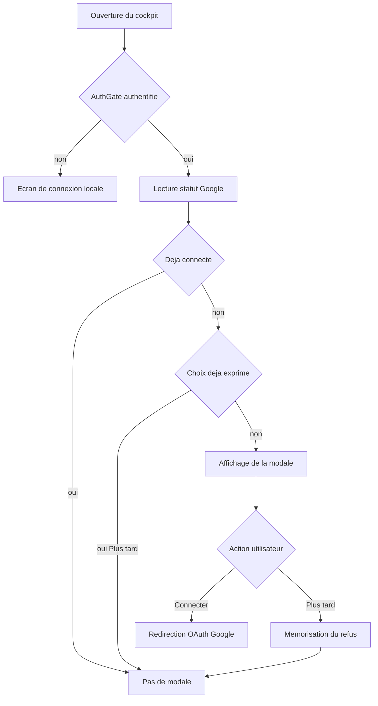

# Connexion Google au démarrage — Modale d'accueil

## 0. Diagnostic : pourquoi le message apparaît

Le message actuel n'est pas un bug, c'est un état honnête :

> Aucun compte Google connecté
> La configuration OAuth serveur est incomplète (GOOGLE_CLIENT_ID, GOOGLE_CLIENT_SECRET, GOOGLE_REDIRECT_URI).

Deux causes distinctes se cumulent :

| # | Cause | Qui peut la corriger |
|---|-------|----------------------|
| 1 | Les variables `GOOGLE_CLIENT_ID`, `GOOGLE_CLIENT_SECRET`, `GOOGLE_REDIRECT_URI` ne sont pas définies dans `.env.local` (le fichier n'existe pas encore ; `.gitignore` ligne 34 ignore `.env*`). | L'utilisateur, une seule fois, via Google Cloud Console |
| 2 | L'UX est passive : la connexion est enfouie dans *Paramètres → Google*, sans invitation au démarrage. | Nous (ce plan) |

**Point clé :** aucune fenêtre de connexion Google ne peut fonctionner sans les identifiants OAuth. Google exige une identité d'application enregistrée (Client ID + Client Secret) liée au compte Google de l'utilisateur. C'est une étape manuelle incontournable, à faire une seule fois.

Ce plan traite **les deux** : d'abord un guide de configuration, ensuite la modale au démarrage.

---

## 1. Guide de configuration Google Cloud (une seule fois)

### 1.1 Créer le projet et l'écran de consentement

1. Aller sur https://console.cloud.google.com/
2. Créer un projet nommé `Nellimmo Cockpit`.
3. Menu **APIs & Services → OAuth consent screen** :
   - Type : **External** (ou **Internal** si compte Google Workspace).
   - App name : `Nell'Immo Cockpit`
   - User support email : l'email de l'agence.
   - Developer contact : l'email de l'agence.
   - **Scopes** : ajouter les scopes listés en §1.3.
   - **Test users** : ajouter l'adresse Gmail de l'utilisateur (obligatoire tant que l'app est en mode « Testing »).

### 1.2 Créer les identifiants OAuth

1. **APIs & Services → Credentials → Create Credentials → OAuth client ID**
2. Application type : **Web application**
3. Nom : `Nellimmo Web`
4. **Authorized redirect URIs** — ajouter les deux :
   - `http://localhost:3000/api/google/oauth/callback` (développement)
   - `https://<domaine-de-production>/api/google/oauth/callback` (production)
5. Récupérer le **Client ID** et le **Client Secret**.

### 1.3 Activer les APIs et scopes nécessaires

| Service | API à activer | Scope |
|---------|---------------|-------|
| Calendar | Google Calendar API | `https://www.googleapis.com/auth/calendar` |
| Gmail | Gmail API | `https://www.googleapis.com/auth/gmail.send`, `gmail.readonly` |
| Drive | Google Drive API | `https://www.googleapis.com/auth/drive.file` |
| Contacts | People API | `https://www.googleapis.com/auth/contacts` |
| Tasks | Google Tasks API | `https://www.googleapis.com/auth/tasks` |
| Reviews | Business Profile API | `https://www.googleapis.com/auth/business.manage` (nécessite une demande d'accès séparée) |

### 1.4 Créer le fichier `.env.local`

À la racine du projet, créer `.env.local` (jamais commité) :

```env
GOOGLE_CLIENT_ID=xxxxxxxxxxxx.apps.googleusercontent.com
GOOGLE_CLIENT_SECRET=GOCSPX-xxxxxxxxxxxxxxxx
GOOGLE_REDIRECT_URI=http://localhost:3000/api/google/oauth/callback

# 32 octets encodés en base64 (générer avec : openssl rand -base64 32)
GOOGLE_TOKEN_ENCRYPTION_KEY=xxxxxxxxxxxxxxxxxxxxxxxxxxxxxxxxxxxxxxxxxxx=

# Secret HMAC pour signer les cookies d'état OAuth (openssl rand -base64 32)
GOOGLE_OAUTH_STATE_SECRET=xxxxxxxxxxxxxxxxxxxxxxxxxxxxxxxxxxxxxxxxxxx=
```

### 1.5 Appliquer la migration Supabase

Exécuter [`supabase/migrations/20260910_google_oauth_tokens.sql`](supabase/migrations/20260910_google_oauth_tokens.sql:1) dans le SQL Editor Supabase.

### 1.6 Redémarrer le serveur

`npm run dev` — les variables d'environnement ne sont lues qu'au démarrage.

---

## 2. Modale de connexion au démarrage

### 2.1 Comportement attendu



### 2.2 Règles de déclenchement

- La modale s'affiche **après** l'authentification locale (jamais par-dessus l'écran de login).
- Elle ne s'affiche **pas** si `status.connected === true`.
- Elle ne s'affiche **pas** si l'utilisateur a déjà cliqué « Plus tard » (mémorisé).
- Elle ne s'affiche **pas** si `status.configured === false` — à la place, un message d'aide renvoyant au §1 (sinon l'utilisateur clique « Connecter » et tombe sur une erreur serveur).
- Elle est **non bloquante** : bouton « Plus tard » toujours visible, fermeture par Échap et par clic sur le fond.

### 2.3 Mémorisation du choix

Nouvelle clé `localStorage` : `nellimmo_google_prompt_dismissed`.

- Valeur `'1'` posée au clic sur « Plus tard ».
- Effacée lors d'une connexion réussie (pour permettre une ré-invitation si déconnexion ultérieure).
- Lue au montage pour décider de l'affichage.

### 2.4 Fichiers à créer

| Fichier | Rôle |
|---------|------|
| [`components/cockpit/google/useGoogleStartupPrompt.ts`](components/cockpit/google/useGoogleStartupPrompt.ts:1) | Hook : lit le statut, lit/écrit `localStorage`, expose `shouldShow`, `dismiss`, `connect`, `isConfigured` |
| [`components/cockpit/google/GoogleStartupModal.tsx`](components/cockpit/google/GoogleStartupModal.tsx:1) | Composant présentationnel : modale d'invitation avec boutons « Connecter Google » / « Plus tard » |

### 2.5 Fichiers à modifier

| Fichier | Modification |
|---------|--------------|
| [`app/cockpit/layout.tsx`](app/cockpit/layout.tsx:36) | Monter `<GoogleStartupModal />` à l'intérieur de `<AuthGate>` (donc après authentification), à côté de `<PwaRegister />` |

### 2.6 Contenu de la modale

- **Titre** : « Connectez votre compte Google »
- **Description** : « Synchronisez votre agenda, vos emails, vos dossiers Drive, vos contacts et vos tâches avec Nell'Immo. »
- **Liste des services** : icônes + libellés (Calendar, Gmail, Drive, Contacts, Tasks, Reviews) avec une courte phrase par service.
- **Note de confidentialité** : « Vos identifiants ne sont jamais stockés dans l'application. Les jetons sont chiffrés (AES-256-GCM) et révocables à tout moment. »
- **Bouton principal** : « Connecter Google » → `connect()` (redirection vers `/api/google/oauth/start`).
- **Bouton secondaire** : « Plus tard » → `dismiss()`.
- **Cas `configured === false`** : remplacer le bouton principal par un encart d'aide « Configuration serveur requise » avec la liste des variables manquantes et un renvoi vers la documentation.

### 2.7 Garde-fous

- Aucun polling : un seul appel à `/api/google/oauth/status` au montage.
- Aucun jeton exposé au client (le hook ne lit que des métadonnées).
- La modale ne bloque jamais la navigation : « Plus tard » est toujours accessible.
- Pas de réapparition intempestive : le refus est persistant.
- Aucune dépendance ajoutée.

---

## 3. Ordre d'exécution

1. Rédiger le guide de configuration Google Cloud dans un fichier `docs/07_CONFIGURATION_GOOGLE_OAUTH.md`.
2. Créer le hook `useGoogleStartupPrompt`.
3. Créer le composant `GoogleStartupModal`.
4. Monter la modale dans `app/cockpit/layout.tsx`.
5. Vérifier le typecheck et le build.
6. Commit et push.

---

## 4. Prérequis utilisateur (hors code)

Ces étapes ne peuvent pas être automatisées et doivent être faites par l'utilisateur avant que la modale ne fonctionne réellement :

- [ ] Créer le projet Google Cloud et l'écran de consentement (§1.1)
- [ ] Créer les identifiants OAuth et déclarer les URI de redirection (§1.2)
- [ ] Activer les 6 APIs (§1.3)
- [ ] Créer `.env.local` avec les 5 variables (§1.4)
- [ ] Appliquer la migration Supabase (§1.5)
- [ ] Redémarrer `npm run dev` (§1.6)
