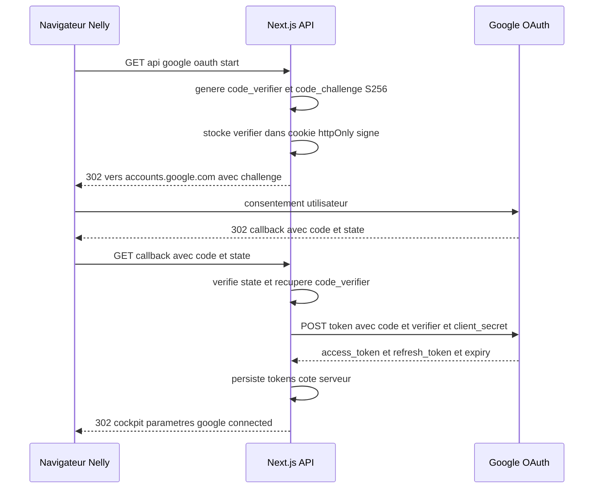
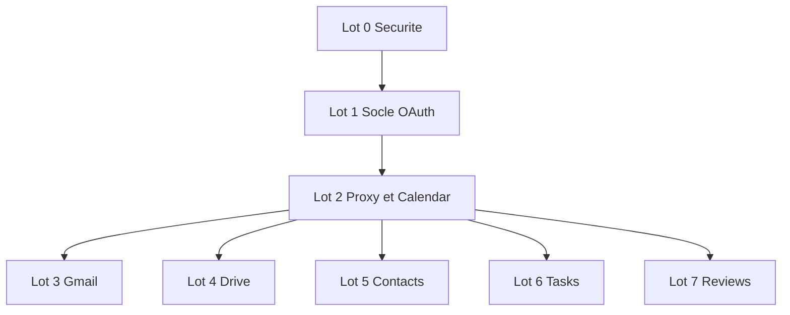

# Intégration Google Workspace OAuth 2.0 — Nell'Immo Cockpit

**Type :** Plan d'architecture (aucun code modifié).
**Cible :** Next.js 16.3.4 (App Router, Turbopack), React 19, TypeScript, Tailwind 4, Supabase `@supabase/supabase-js` ^2.114.0.
**Objectif :** remplacer les faux boutons Google par une **vraie connexion OAuth 2.0** et des appels réseau réels vers Calendar, Gmail, Drive, Contacts, Tasks et Business Profile.

---

## 0. État des lieux (vérifié dans le code)

| Élément | Fichier | Constat |
|---|---|---|
| Auth applicative | [`lib/auth.ts`](lib/auth.ts:1) | Authentification **locale** (localStorage/sessionStorage, SHA-256), documentée « solution transitoire ». |
| Utilisateurs | [`lib/users.ts`](lib/users.ts:1) | Comptes locaux multi-utilisateurs (admin/agent). |
| Supabase | [`lib/supabase.ts`](lib/supabase.ts:8) | [`isSupabaseConfigured()`](lib/supabase.ts:8) + [`getSupabaseClient()`](lib/supabase.ts:17). Retourne `null` si non configuré. |
| Paramètres Google | [`lib/types.ts`](lib/types.ts:397) | `google_account_email`, `google_client_id`, `google_client_secret`, `google_calendar_id`, `google_maps_api_key`, `google_my_business_url`, `google_drive_folder_id`, `google_services_enabled`. |
| Coffre local | [`lib/vault.ts`](lib/vault.ts:28) | `SENSITIVE_SETTINGS_FIELDS` chiffre déjà `google_client_secret` et `google_maps_api_key` en AES-GCM côté client. |
| Store | [`lib/store.tsx`](lib/store.tsx:661) | [`updateSettingsAction()`](lib/store.tsx:661) sépare secrets/publics et persiste dans Supabase `agency_settings` si configuré. |
| UI Google | [`GoogleSection.tsx`](components/cockpit/parametres/GoogleSection.tsx:24) | [`handleQuickSync()`](components/cockpit/parametres/GoogleSection.tsx:34) = **validation locale par regex**, aucun appel réseau. |
| Modal connexion | [`GoogleConnectModal.tsx`](components/cockpit/parametres/google/GoogleConnectModal.tsx:38) | [`handleTestConnection()`](components/cockpit/parametres/google/GoogleConnectModal.tsx:38) valide juste le format email. |
| Helpers URL | [`lib/google.ts`](lib/google.ts:1) | Constructeurs d'URL (Maps, Calendar template, Gmail compose, Drive, Street View). |
| Gmail | [`lib/gmail.ts`](lib/gmail.ts:15) | [`createGmailComposeUrl()`](lib/gmail.ts:15) / [`openGmailCompose()`](lib/gmail.ts:33) ouvrent un onglet, n'envoient rien. |
| Pattern API | [`app/api/settings/ai-key/route.ts`](app/api/settings/ai-key/route.ts:1) | `NextRequest`/`NextResponse`, env + cookie httpOnly + fichier serveur, validation par ping réel, masquage de clé. |
| Migrations | `supabase/migrations/` | `20260902_init_nellimo.sql`, `20260903_rls_owner_scoped_public_split.sql`, `20260903_solo_agent_os.sql`. Colonne `owner_id` déjà généralisée. |

### Problèmes de sécurité identifiés

1. **`google_client_secret` en clair dans le store.** Le champ existe dans [`AgencySettings`](lib/types.ts:402) et est poussé tel quel dans Supabase par [`updateSettingsAction()`](lib/store.tsx:674) (`upsert({ id: 'default', ...newSettings })`). Le coffre [`lib/vault.ts`](lib/vault.ts:28) le chiffre côté client, mais **un `client_secret` ne doit jamais transiter par le navigateur** : il doit vivre uniquement côté serveur.
2. **`google_maps_api_key`** est une clé API (pas un secret OAuth) : acceptable côté client si restreinte par référent HTTP, mais à ne pas confondre avec un secret OAuth.
3. **`google_connected_at`** est positionné par une validation regex ([`GoogleSection.tsx`](components/cockpit/parametres/GoogleSection.tsx:54)) → l'UI affiche « Connecté » sans qu'aucun token n'existe. C'est le « faux bouton » à éliminer.
4. **Aucune révocation** : impossible de déconnecter proprement un compte Google.

---

## 1. Architecture OAuth 2.0

### 1.1 Choix du flow : Authorization Code + PKCE

**Décision : Authorization Code Flow avec PKCE (`S256`), `access_type=offline`, `prompt=consent`.**

Justification :

- Une application web Next.js ne peut pas embarquer un `client_secret` de façon sûre (le bundle JS est public). Le flow **Implicit** est déprécié par Google et ne délivre pas de `refresh_token`.
- **PKCE** (`code_challenge` / `code_verifier`) lie la requête d'autorisation à l'échange de token : un code intercepté est inutilisable sans le `code_verifier`, qui ne quitte jamais le serveur.
- `access_type=offline` est **obligatoire** pour obtenir un `refresh_token` (nécessaire aux envois Gmail/Calendar asynchrones).
- `prompt=consent` force la réémission du `refresh_token` à chaque reconnexion (Google ne le renvoie qu'à la première autorisation sinon).
- Le `client_secret` reste **côté serveur uniquement** (routes API), utilisé en complément de PKCE pour les clients « Web application » Google.



### 1.2 Où stocker `client_id` / `client_secret`

**Recommandation : variables d'environnement serveur exclusivement.**

```env
# .env.local (jamais commité)
GOOGLE_CLIENT_ID=xxxxxxxx.apps.googleusercontent.com
GOOGLE_CLIENT_SECRET=GOCSPX-xxxxxxxxxxxxxxxx
GOOGLE_REDIRECT_URI=https://<domaine>/api/google/oauth/callback
# Clé de chiffrement des tokens au repos (32 octets base64)
GOOGLE_TOKEN_ENCRYPTION_KEY=xxxxxxxxxxxxxxxxxxxxxxxxxxxxxxxx
# Secret de signature des cookies d'état OAuth
GOOGLE_OAUTH_STATE_SECRET=xxxxxxxxxxxxxxxxxxxxxxxxxxxxxxxx
```

Traitement des champs existants :

| Champ `AgencySettings` | Devenir |
|---|---|
| `google_client_id` | **Déprécié côté client.** Conservé en lecture seule pour affichage (valeur publique, non sensible). La source de vérité devient `process.env.GOOGLE_CLIENT_ID`. |
| `google_client_secret` | **À retirer de l'UI et du store.** Retiré de `SENSITIVE_SETTINGS_FIELDS` après migration ; la valeur en base doit être purgée (`UPDATE agency_settings SET google_client_secret = NULL`). |
| `google_account_email` / `google_account_name` | Deviennent **dérivés** de l'appel `userinfo` (source de vérité = Google), plus saisis à la main. |
| `google_connected_at` | Devient **dérivé** de l'existence d'un token valide (route `status`), plus positionné par regex. |
| `google_calendar_id` | Conservé (choix du calendrier cible, `primary` par défaut). |
| `google_maps_api_key` | Conservé (clé API, pas OAuth). |
| `google_services_enabled` | Conservé (interrupteurs d'activation par service). |

> **Action de sécurité prioritaire (Lot 0) :** purger `google_client_secret` du localStorage, du coffre et de la table `agency_settings`, puis retirer le champ de l'UI [`GoogleSection.tsx`](components/cockpit/parametres/GoogleSection.tsx:24).

### 1.3 Routes API à créer

Toutes sous `app/api/google/`. Convention : `NextRequest`/`NextResponse`, `export const runtime = 'nodejs'` (crypto Node pour le chiffrement), `export const dynamic = 'force-dynamic'`.

| Route | Méthode | Rôle |
|---|---|---|
| [`app/api/google/oauth/start/route.ts`](app/api/google/oauth/start/route.ts) | `GET` | Génère `state` + PKCE, pose les cookies httpOnly, redirige vers Google. |
| [`app/api/google/oauth/callback/route.ts`](app/api/google/oauth/callback/route.ts) | `GET` | Vérifie `state`, échange `code` → tokens, appelle `userinfo`, persiste, redirige vers le cockpit. |
| [`app/api/google/oauth/status/route.ts`](app/api/google/oauth/status/route.ts) | `GET` | Retourne `{ connected, email, name, scopes, expiresAt, services }` — **jamais** les tokens. |
| [`app/api/google/oauth/disconnect/route.ts`](app/api/google/oauth/disconnect/route.ts) | `POST` | Révoque le token chez Google (`/revoke`), supprime la ligne, efface les cookies. |
| [`app/api/google/oauth/refresh/route.ts`](app/api/google/oauth/refresh/route.ts) | `POST` | Rafraîchissement explicite (fallback si le refresh automatique échoue). |
| [`app/api/google/proxy/route.ts`](app/api/google/proxy/route.ts) | `POST` | Proxy générique : `{ service, action, payload }` → appel REST Google avec token valide. |

**Recommandation proxy :** commencer par **une route proxy générique** `/api/google/proxy` (surface réduite, un seul point d'injection du token, allow-list d'endpoints), puis extraire des routes dédiées (`/api/google/calendar`, `/api/google/gmail`, …) uniquement si un service devient complexe (upload Drive multipart, webhooks). Cela évite 6 routes quasi identiques dès le départ.

Exemple de contrat du proxy :

```ts
// app/api/google/proxy/route.ts
type GoogleProxyRequest = {
  service: 'calendar' | 'gmail' | 'drive' | 'contacts' | 'tasks' | 'reviews';
  action: string;              // ex: 'events.insert', 'messages.send'
  payload?: unknown;
  query?: Record<string, string>;
};
```

### 1.4 Stockage des tokens : comparaison

| Critère | Table Supabase `google_oauth_tokens` | Cookie httpOnly chiffré |
|---|---|---|
| Persistance multi-appareils | Oui | Non (lié au navigateur) |
| Taille | Illimitée (refresh_token ~200 o) | Limite 4 Ko par cookie |
| Révocation centralisée | Oui (`DELETE` en base) | Difficile |
| Fonctionne sans Supabase | Non | Oui |
| RLS / multi-agent | Oui (`owner_id` + RLS) | Non |
| Complexité | Moyenne (migration + RLS) | Faible |
| Sécurité au repos | Chiffrement colonne + RLS | httpOnly + `Secure` + `SameSite=Lax` |

**Recommandation : approche hybride à deux niveaux.**

1. **Mode Supabase configuré (cible) :** table `google_oauth_tokens` avec `owner_id`, RLS stricte, tokens **chiffrés en colonne** (AES-256-GCM via `GOOGLE_TOKEN_ENCRYPTION_KEY`, chiffrement/déchiffrement dans [`lib/google/token-store.ts`](lib/google/token-store.ts)). Le `refresh_token` n'est **jamais** renvoyé au client.
2. **Mode local (Supabase non configuré) :** cookie httpOnly chiffré contenant `{ refresh_token, expiry, scope, email }`, signé et chiffré avec `GOOGLE_TOKEN_ENCRYPTION_KEY`. Permet à l'app de rester fonctionnelle en local-first, conformément à la doctrine « gérer le cas Supabase non configuré ».

Le choix est encapsulé derrière une interface unique :

```ts
// lib/google/token-store.ts
export interface GoogleTokenRecord {
  ownerId: string;
  email: string;
  name?: string;
  accessToken: string;
  refreshToken: string;
  expiry: number;      // epoch ms
  scope: string;
  tokenType: string;
}

export interface GoogleTokenStore {
  save(record: GoogleTokenRecord): Promise<void>;
  load(ownerId: string): Promise<GoogleTokenRecord | null>;
  clear(ownerId: string): Promise<void>;
}

export function getTokenStore(): GoogleTokenStore; // SupabaseTokenStore | CookieTokenStore
```

### 1.5 Migration Supabase

```sql
-- supabase/migrations/20260910_google_oauth_tokens.sql
CREATE TABLE IF NOT EXISTS google_oauth_tokens (
    id UUID PRIMARY KEY DEFAULT uuid_generate_v4(),
    owner_id UUID NOT NULL REFERENCES profiles(id) ON DELETE CASCADE,
    google_email TEXT NOT NULL,
    google_name TEXT,
    -- Tokens chiffrés AES-256-GCM (jamais en clair)
    access_token_enc TEXT NOT NULL,
    refresh_token_enc TEXT NOT NULL,
    token_iv TEXT NOT NULL,
    token_auth_tag TEXT NOT NULL,
    expiry TIMESTAMPTZ NOT NULL,
    scope TEXT NOT NULL,
    token_type TEXT NOT NULL DEFAULT 'Bearer',
    created_at TIMESTAMPTZ DEFAULT timezone('utc'::text, now()) NOT NULL,
    updated_at TIMESTAMPTZ DEFAULT timezone('utc'::text, now()) NOT NULL,
    UNIQUE (owner_id, google_email)
);

ALTER TABLE google_oauth_tokens ENABLE ROW LEVEL SECURITY;

CREATE POLICY "owner_select_own_google_tokens" ON google_oauth_tokens
    FOR SELECT USING (auth.uid() = owner_id);
CREATE POLICY "owner_insert_own_google_tokens" ON google_oauth_tokens
    FOR INSERT WITH CHECK (auth.uid() = owner_id);
CREATE POLICY "owner_update_own_google_tokens" ON google_oauth_tokens
    FOR UPDATE USING (auth.uid() = owner_id);
CREATE POLICY "owner_delete_own_google_tokens" ON google_oauth_tokens
    FOR DELETE USING (auth.uid() = owner_id);
```

> **Note :** tant que l'auth locale ([`lib/auth.ts`](lib/auth.ts:1)) est active, `auth.uid()` est `null`. Le `ownerId` est alors résolu via un identifiant d'agence stable (`agency_settings.id = 'default'`) et la route API utilise la **clé service_role** côté serveur, jamais exposée au client. La migration vers Supabase Auth remplacera ce repli sans changer l'interface [`GoogleTokenStore`](lib/google/token-store.ts).

### 1.6 Rafraîchissement automatique du token

```ts
// lib/google/oauth-client.ts
export async function getValidAccessToken(ownerId: string): Promise<string> {
  const record = await getTokenStore().load(ownerId);
  if (!record) throw new GoogleNotConnectedError();

  // Marge de sécurité de 60 s avant expiration
  if (record.expiry - Date.now() > 60_000) {
    return record.accessToken;
  }

  const res = await fetch('https://oauth2.googleapis.com/token', {
    method: 'POST',
    headers: { 'Content-Type': 'application/x-www-form-urlencoded' },
    body: new URLSearchParams({
      client_id: process.env.GOOGLE_CLIENT_ID!,
      client_secret: process.env.GOOGLE_CLIENT_SECRET!,
      refresh_token: record.refreshToken,
      grant_type: 'refresh_token',
    }),
  });

  if (!res.ok) {
    // refresh_token révoqué ou expiré → nettoyage + signal UI
    await getTokenStore().clear(ownerId);
    throw new GoogleTokenRevokedError();
  }

  const data = await res.json();
  await getTokenStore().save({
    ...record,
    accessToken: data.access_token,
    expiry: Date.now() + data.expires_in * 1000,
    scope: data.scope ?? record.scope,
  });
  return data.access_token;
}
```

Le rafraîchissement est **paresseux** (à la demande, au moment d'un appel service) : pas de cron, pas de polling.

### 1.7 Révocation et déconnexion

```ts
// app/api/google/oauth/disconnect/route.ts
export async function POST(req: NextRequest) {
  const ownerId = await resolveOwnerId(req);
  const record = await getTokenStore().load(ownerId);
  if (record) {
    // Révocation côté Google (best-effort)
    await fetch('https://oauth2.googleapis.com/revoke', {
      method: 'POST',
      headers: { 'Content-Type': 'application/x-www-form-urlencoded' },
      body: new URLSearchParams({ token: record.refreshToken }),
    }).catch(() => {});
    await getTokenStore().clear(ownerId);
  }
  const res = NextResponse.json({ success: true });
  clearOAuthCookies(res);
  return res;
}
```

---

## 2. Scopes Google à demander

Demande **incrémentale** recommandée : ne demander que les scopes des services activés dans `google_services_enabled`, pour limiter l'écran de consentement et le risque de vérification Google.

| Service | Scope | Justification | Sensible ? |
|---|---|---|---|
| **Identité** | `openid email profile` | Récupérer email + nom du compte connecté via `userinfo`. Source de vérité pour `google_account_email` / `google_account_name`. | Non |
| **Calendar** | `https://www.googleapis.com/auth/calendar` | Lecture/écriture complète : créer les RDV visite/notaire/estimation depuis [`AgendaEvent`](components/cockpit/agenda/agenda-types.ts:13), lire les disponibilités (`freebusy`). | Sensible |
| **Gmail (envoi)** | `https://www.googleapis.com/auth/gmail.send` | Envoi réel des emails de relance et comptes-rendus (remplace [`openGmailCompose()`](lib/gmail.ts:33)). | Sensible (vérification) |
| **Gmail (lecture)** | `https://www.googleapis.com/auth/gmail.readonly` | Optionnel : lier les échanges entrants à la timeline [`ContactInteraction`](lib/types.ts:707) (type `email_gmail`). À activer seulement si Nelly le souhaite. | Très sensible (vérification) |
| **Drive** | `https://www.googleapis.com/auth/drive.file` | Créer/gérer **uniquement les fichiers créés par l'app** (dossiers mandats ALUR, photos HD, diagnostics). Plus sûr que `drive` (accès total). | Sensible |
| **Contacts** | `https://www.googleapis.com/auth/contacts` | Sync bidirectionnelle avec [`ContactItem`](lib/types.ts:725) (People API). | Sensible |
| **Tasks** | `https://www.googleapis.com/auth/tasks` | Pousser les relances de [`computeRelances()`](lib/relances.ts:252) vers Google Tasks. | Sensible |
| **Business Profile** | `https://www.googleapis.com/auth/business.manage` | Récupérer les avis Google réels (remplace `google_my_business_url` statique). | **Approbation Google spécifique requise** |
| **Maps** | — | **Pas d'OAuth.** Clé API séparée (`google_maps_api_key`), déjà gérée. | — |

> **Note Business Profile :** l'API Google Business Profile nécessite une **demande d'accès** validée par Google (formulaire dédié, délai variable). Le service `reviews` doit donc être **dégradable** : si l'accès n'est pas accordé, l'UI retombe sur le lien statique `google_my_business_url` existant.

---

## 3. Intégrations concrètes par service

Chaque service = **un hook `use*` dédié** (doctrine AGENTS.md : logique séparée des composants) + appels via `/api/google/proxy`.

### 3.1 Calendar

**Hook :** [`components/cockpit/agenda/useGoogleCalendar.ts`](components/cockpit/agenda/useGoogleCalendar.ts)

**Fonctions :**

```ts
export function useGoogleCalendar() {
  const createEvent = async (event: AgendaEvent): Promise<{ id: string; htmlLink: string }>;
  const updateEvent = async (googleEventId: string, event: AgendaEvent): Promise<void>;
  const deleteEvent = async (googleEventId: string): Promise<void>;
  const getFreeBusy = async (timeMin: string, timeMax: string): Promise<BusySlot[]>;
  const isConnected: boolean;
}
```

**Mapping [`AgendaEvent`](components/cockpit/agenda/agenda-types.ts:13) → Google Calendar :**

| Champ `AgendaEvent` | Champ Google Calendar |
|---|---|
| `title` | `summary` |
| `date` + `time` + `durationMinutes` | `start.dateTime` / `end.dateTime` (RFC3339, timezone `Europe/Paris`) |
| `location` | `location` |
| `notes` | `description` |
| `contactName` / `contactPhone` | `description` (append) + `attendees` si email connu |
| `category` | `extendedProperties.private.nellimmo_category` |
| `mandateNumber` / `propertyId` / `transactionId` | `extendedProperties.private.*` (permet la réconciliation) |

**Requête REST :**

```ts
await fetch('https://www.googleapis.com/calendar/v3/calendars/primary/events', {
  method: 'POST',
  headers: { Authorization: `Bearer ${accessToken}`, 'Content-Type': 'application/json' },
  body: JSON.stringify({
    summary: event.title,
    location: event.location,
    description: event.notes,
    start: { dateTime: `${event.date}T${event.time}:00`, timeZone: 'Europe/Paris' },
    end: { dateTime: computeEnd(event), timeZone: 'Europe/Paris' },
    extendedProperties: { private: { nellimmo_category: event.category } },
  }),
});
```

**Points d'intégration UI :** bouton « Ajouter à Google Agenda » sur les événements de [`buildAllEvents()`](components/cockpit/agenda/agenda-types.ts:58) (visites, compromis, SRU, acte), remplaçant [`createGoogleCalendarUrl()`](lib/google.ts:206) (qui ouvre un template). Conserver le lien template en **fallback** si non connecté.

### 3.2 Gmail

**Hook :** [`components/cockpit/contacts/useGmailSender.ts`](components/cockpit/contacts/useGmailSender.ts)

**Fonctions :**

```ts
export function useGmailSender() {
  const sendEmail = async (options: EmailComposeOptions & {
    contactId?: string;
    templateId?: string;
  }): Promise<{ messageId: string }>;
  const isConnected: boolean;
}
```

**Envoi réel :** construction MIME RFC 2822, encodage base64url, POST `messages/send`.

```ts
const raw = [
  `To: ${to}`,
  `Subject: =?UTF-8?B?${Buffer.from(subject).toString('base64')}?=`,
  'Content-Type: text/plain; charset=UTF-8',
  '',
  body,
].join('\r\n');

await fetch('https://gmail.googleapis.com/gmail/v1/users/me/messages/send', {
  method: 'POST',
  headers: { Authorization: `Bearer ${accessToken}`, 'Content-Type': 'application/json' },
  body: JSON.stringify({ raw: Buffer.from(raw).toString('base64url') }),
});
```

**Traçage dans la timeline :** après envoi, appeler l'action existante `addContactInteraction` avec `type: 'email_gmail'` (type déjà défini dans [`ContactInteractionType`](lib/types.ts:699), pattern déjà utilisé dans [`mock-data-cockpit.ts`](lib/mock-data-cockpit.ts:728)) :

```ts
await addContactInteraction(contactId, {
  type: 'email_gmail',
  title: subject,
  description: `Envoyé via Gmail API à ${to}`,
  date: new Date().toISOString(),
});
```

**Remplacement :** [`openGmailCompose()`](lib/gmail.ts:33) reste disponible en fallback (non connecté). Les templates [`EMAIL_TEMPLATES`](lib/gmail.ts:66) sont réutilisés tels quels pour le corps.

### 3.3 Drive

**Hook :** [`components/cockpit/mandats/useGoogleDrive.ts`](components/cockpit/mandats/useGoogleDrive.ts)

**Fonctions :**

```ts
export function useGoogleDrive() {
  const ensureMandateTree = async (mandateRef: string, propertyTitle: string): Promise<{
    rootFolderId: string;
    folders: Record<string, string>; // nom → folderId
  }>;
  const uploadFile = async (folderId: string, file: File | Blob, name: string): Promise<{ id: string; webViewLink: string }>;
  const getFolderLink = (folderId: string): string;
}
```

**Création d'arborescence :** remplacer [`generateMandateDriveTreeText()`](lib/google.ts:346) (texte à copier) et [`generateAlurBatchScript()`](lib/google.ts:282) (script .bat) par une vraie création via l'API Drive, en réutilisant la nomenclature [`MANDATE_ALUR_FOLDERS`](lib/google.ts:269) :

```ts
// 1. Créer le dossier racine du mandat
const root = await driveCreateFolder({
  name: `Nell'Immo — Mandat ${mandateRef} (${propertyTitle})`,
  parents: [settings.google_drive_folder_id], // dossier racine agence
});

// 2. Créer les 6 sous-dossiers ALUR
for (const folderName of MANDATE_ALUR_FOLDERS) {
  await driveCreateFolder({ name: folderName, parents: [root.id] });
}
```

```ts
// POST https://www.googleapis.com/drive/v3/files
// ?supportsAllDrives=true&fields=id,name,webViewLink
body: JSON.stringify({
  name: folderName,
  mimeType: 'application/vnd.google-apps.folder',
  parents: [parentId],
})
```

**Upload :** `POST https://www.googleapis.com/upload/drive/v3/files?uploadType=multipart` (multipart/related : métadonnées + contenu binaire). Scope `drive.file` suffit car l'app crée les fichiers.

**Stockage du `rootFolderId` :** ajouter un champ optionnel `google_drive_mandate_folders?: Record<string, string>` (clé = `propertyId`) dans [`AgencySettings`](lib/types.ts:397) ou, mieux, une colonne `drive_folder_id` sur `properties` (migration dédiée) pour éviter de gonfler les settings.

### 3.4 Contacts

**Hook :** [`components/cockpit/contacts/useGoogleContacts.ts`](components/cockpit/contacts/useGoogleContacts.ts)

**Fonctions :**

```ts
export function useGoogleContacts() {
  const pushContact = async (contact: ContactItem): Promise<{ resourceName: string }>;
  const pullContacts = async (): Promise<GooglePerson[]>;
  const syncBidirectional = async (contacts: ContactItem[]): Promise<SyncReport>;
  const isConnected: boolean;
}
```

**Push :** `POST https://people.googleapis.com/v1/people:createContact` (ou `PATCH .../people/{resourceName}:updateContact` si déjà lié).

**Pull :** `GET https://people.googleapis.com/v1/people/me/connections?personFields=names,emailAddresses,phoneNumbers,organizations&pageSize=1000`.

**Déduplication :** réutiliser la logique existante `upsertContactFromLead` (déjà mentionnée dans le code) et matcher sur `email` normalisé (lowercase) puis `phone` (E.164). Stocker le `resourceName` Google dans un champ `google_resource_name?: string` sur [`ContactItem`](lib/types.ts:725) pour éviter les doublons lors des syncs suivants.

**Mapping :**

| `ContactItem` | Google People |
|---|---|
| `first_name` / `last_name` | `names[0].givenName` / `familyName` |
| `email` | `emailAddresses[0].value` |
| `phone` | `phoneNumbers[0].value` |
| `company` | `organizations[0].name` |
| `role` | `biographies[0].value` (ou `memberships`) |

**Garde-fou :** la sync bidirectionnelle est **manuelle** (bouton « Synchroniser »), jamais automatique en arrière-plan, pour éviter les conflits silencieux.

### 3.5 Tasks

**Hook :** [`components/cockpit/relances/useGoogleTasks.ts`](components/cockpit/relances/useGoogleTasks.ts)

**Fonctions :**

```ts
export function useGoogleTasks() {
  const pushRelance = async (action: RelanceAction): Promise<{ taskId: string }>;
  const pushAllRelances = async (actions: RelanceAction[]): Promise<PushReport>;
  const completeTask = async (taskId: string): Promise<void>;
  const isConnected: boolean;
}
```

**Source :** [`computeRelances()`](lib/relances.ts:252) retourne des `RelanceAction[]` (visite_rappel, visite_relance, transaction_pret, transaction_sru, …). Chaque action devient une tâche :

```ts
// POST https://tasks.googleapis.com/tasks/v1/lists/@default/tasks
body: JSON.stringify({
  title: action.label,
  notes: action.message,
  due: toRfc3339(action.dueDate),
});
```

**Idempotence :** stocker le `taskId` retourné dans un champ `google_task_id?: string` sur `RelanceAction` (ou une map `relanceKey → taskId` persistée) pour éviter les doublons lors de pushes répétés.

### 3.6 Reviews / Business Profile

**Hook :** [`components/cockpit/parametres/google/useGoogleReviews.ts`](components/cockpit/parametres/google/useGoogleReviews.ts)

**Fonctions :**

```ts
export function useGoogleReviews() {
  const fetchReviews = async (): Promise<GoogleReview[]>;
  const getAverageRating = async (): Promise<{ average: number; total: number }>;
  const isConnected: boolean;
  const isApiApproved: boolean; // false si accès Business Profile non accordé
}
```

**Appels :** `GET https://mybusiness.googleapis.com/v4/accounts/{accountId}/locations/{locationId}/reviews` (nécessite `business.manage` + approbation Google).

**Fallback :** si `isApiApproved === false`, l'UI [`GoogleSection.tsx`](components/cockpit/parametres/GoogleSection.tsx:103) conserve le lien statique `google_my_business_url` et le message [`createGoogleReviewMessage()`](lib/google.ts:383). Aucun faux avis n'est affiché.

---

## 4. Plan d'implémentation par lots

Ordre strict : **socle OAuth d'abord**, intégrations service par service ensuite.

### Lot 0 — Assainissement sécurité (prérequis)

**Objectif :** supprimer le `client_secret` du client avant toute nouvelle brique.

- **Fichiers à modifier :**
  - [`lib/types.ts`](lib/types.ts:397) — déprécier `google_client_secret` (commentaire `@deprecated`).
  - [`lib/vault.ts`](lib/vault.ts:28) — retirer `google_client_secret` de `SENSITIVE_SETTINGS_FIELDS` après purge.
  - [`components/cockpit/parametres/GoogleSection.tsx`](components/cockpit/parametres/GoogleSection.tsx:24) — retirer tout champ `client_secret`.
  - Migration SQL de purge : `UPDATE agency_settings SET google_client_secret = NULL;`
- **Dépendances :** aucune.
- **Critère de test :** `google_client_secret` absent du bundle client et de la table.

### Lot 1 — Socle OAuth (connexion / statut / déconnexion)

**Objectif :** Nelly clique « Connecter », consent sur Google, revient connectée. Le statut est **réel**.

- **Fichiers à créer :**
  - [`lib/google/oauth-client.ts`](lib/google/oauth-client.ts) — PKCE, échange de code, refresh, revoke.
  - [`lib/google/token-store.ts`](lib/google/token-store.ts) — interface + implémentations Supabase / cookie.
  - [`lib/google/crypto.ts`](lib/google/crypto.ts) — AES-256-GCM (chiffrement tokens).
  - [`lib/google/scopes.ts`](lib/google/scopes.ts) — catalogue des scopes par service.
  - [`app/api/google/oauth/start/route.ts`](app/api/google/oauth/start/route.ts)
  - [`app/api/google/oauth/callback/route.ts`](app/api/google/oauth/callback/route.ts)
  - [`app/api/google/oauth/status/route.ts`](app/api/google/oauth/status/route.ts)
  - [`app/api/google/oauth/disconnect/route.ts`](app/api/google/oauth/disconnect/route.ts)
  - [`app/api/google/oauth/refresh/route.ts`](app/api/google/oauth/refresh/route.ts)
  - [`supabase/migrations/20260910_google_oauth_tokens.sql`](supabase/migrations/20260910_google_oauth_tokens.sql)
- **Fichiers à modifier :**
  - [`components/cockpit/parametres/google/GoogleConnectModal.tsx`](components/cockpit/parametres/google/GoogleConnectModal.tsx:38) — remplacer la validation email par une redirection `window.location.href = '/api/google/oauth/start'`.
  - [`components/cockpit/parametres/google/GoogleAccountStatusCard.tsx`](components/cockpit/parametres/google/GoogleAccountStatusCard.tsx:15) — afficher l'état issu de `/api/google/oauth/status`.
  - [`components/cockpit/parametres/GoogleSection.tsx`](components/cockpit/parametres/GoogleSection.tsx:34) — [`handleQuickSync()`](components/cockpit/parametres/GoogleSection.tsx:34) appelle la route `status` au lieu de la regex.
- **Nouveau hook :** [`components/cockpit/parametres/google/useGoogleConnection.ts`](components/cockpit/parametres/google/useGoogleConnection.ts) — `{ status, connect, disconnect, refreshStatus }`.
- **Dépendances :** Lot 0.
- **Critère de test :** après consentement, `status` renvoie `connected: true` + email réel ; « Déconnecter » révoque et repasse à `connected: false`.

### Lot 2 — Proxy générique + Calendar

**Objectif :** créer un vrai événement Google Calendar depuis un [`AgendaEvent`](components/cockpit/agenda/agenda-types.ts:13).

- **Fichiers à créer :**
  - [`app/api/google/proxy/route.ts`](app/api/google/proxy/route.ts) — allow-list d'endpoints par service.
  - [`lib/google/services/calendar.ts`](lib/google/services/calendar.ts) — `insertEvent`, `listEvents`, `freeBusy`.
  - [`components/cockpit/agenda/useGoogleCalendar.ts`](components/cockpit/agenda/useGoogleCalendar.ts)
- **Fichiers à modifier :** [`components/cockpit/agenda/`](components/cockpit/agenda/) — bouton « Ajouter à Google Agenda » avec fallback [`createGoogleCalendarUrl()`](lib/google.ts:206).
- **Dépendances :** Lot 1.
- **Critère de test :** l'événement apparaît dans Google Calendar avec le bon horaire `Europe/Paris`.

### Lot 3 — Gmail (envoi réel)

**Objectif :** envoyer un email depuis un template et le tracer dans la timeline contact.

- **Fichiers à créer :**
  - [`lib/google/services/gmail.ts`](lib/google/services/gmail.ts) — `sendMessage` (MIME base64url).
  - [`components/cockpit/contacts/useGmailSender.ts`](components/cockpit/contacts/useGmailSender.ts)
- **Fichiers à modifier :** composants utilisant [`openGmailCompose()`](lib/gmail.ts:33) — basculer sur l'envoi réel si connecté, sinon fallback.
- **Dépendances :** Lot 2 (proxy).
- **Critère de test :** email reçu ; une [`ContactInteraction`](lib/types.ts:707) `email_gmail` est ajoutée.

### Lot 4 — Drive (arborescence mandat + upload)

**Objectif :** créer réellement les 6 dossiers ALUR d'un mandat et uploader des pièces.

- **Fichiers à créer :**
  - [`lib/google/services/drive.ts`](lib/google/services/drive.ts) — `createFolder`, `uploadFile`, `listFiles`.
  - [`components/cockpit/mandats/useGoogleDrive.ts`](components/cockpit/mandats/useGoogleDrive.ts)
- **Fichiers à modifier :**
  - [`lib/google.ts`](lib/google.ts:346) — [`generateMandateDriveTreeText()`](lib/google.ts:346) conservé en fallback texte.
  - Migration : colonne `drive_folder_id` sur `properties`.
- **Dépendances :** Lot 2.
- **Critère de test :** les 6 dossiers [`MANDATE_ALUR_FOLDERS`](lib/google.ts:269) existent dans Drive sous le dossier racine.

### Lot 5 — Contacts (sync bidirectionnelle)

**Objectif :** pousser les [`ContactItem`](lib/types.ts:725) vers Google Contacts et importer les nouveaux.

- **Fichiers à créer :**
  - [`lib/google/services/contacts.ts`](lib/google/services/contacts.ts) — `createContact`, `updateContact`, `listConnections`.
  - [`components/cockpit/contacts/useGoogleContacts.ts`](components/cockpit/contacts/useGoogleContacts.ts)
- **Fichiers à modifier :** [`lib/types.ts`](lib/types.ts:725) — ajouter `google_resource_name?: string` sur `ContactItem`.
- **Dépendances :** Lot 2.
- **Critère de test :** un contact créé dans l'app apparaît dans Google Contacts ; un contact Google importé n'est pas dupliqué (dédup email/téléphone).

### Lot 6 — Tasks (relances → Google Tasks)

**Objectif :** pousser les relances de [`computeRelances()`](lib/relances.ts:252) vers Google Tasks.

- **Fichiers à créer :**
  - [`lib/google/services/tasks.ts`](lib/google/services/tasks.ts) — `insertTask`, `completeTask`.
  - [`components/cockpit/relances/useGoogleTasks.ts`](components/cockpit/relances/useGoogleTasks.ts)
- **Fichiers à modifier :** [`lib/relances.ts`](lib/relances.ts:252) — ajouter `google_task_id?: string` sur `RelanceAction`.
- **Dépendances :** Lot 2.
- **Critère de test :** chaque relance due crée une tâche unique (pas de doublon au second push).

### Lot 7 — Reviews / Business Profile (dégradable)

**Objectif :** afficher les avis Google réels si l'API est approuvée, sinon fallback statique.

- **Fichiers à créer :**
  - [`lib/google/services/reviews.ts`](lib/google/services/reviews.ts) — `listReviews`, `getAverageRating`.
  - [`components/cockpit/parametres/google/useGoogleReviews.ts`](components/cockpit/parametres/google/useGoogleReviews.ts)
- **Fichiers à modifier :** [`components/cockpit/parametres/GoogleSection.tsx`](components/cockpit/parametres/GoogleSection.tsx:103) — afficher les avis réels ou le lien statique.
- **Dépendances :** Lot 2 + approbation Google Business Profile.
- **Critère de test :** si non approuvé, l'UI reste fonctionnelle avec le lien statique (aucune erreur bloquante).

### Récapitulatif des dépendances



---

## 5. Garde-fous anti-surcharge

1. **Pas de polling.** Aucun `setInterval` vers Google. Le rafraîchissement du token est **paresseux** (à l'appel). Pour les mises à jour entrantes, utiliser les **webhooks Google** (Calendar push notifications via `watch`, Gmail `watch` + Pub/Sub) — et seulement si un besoin réel apparaît. Par défaut : refresh manuel / à la demande.
2. **Pas de nouvelle dépendance lourde.** Évaluer `googleapis` (SDK Node volumineux, ~50 Mo, arbres de dépendances) vs **`fetch` direct** vers les endpoints REST. **Recommandation : `fetch` direct** — les endpoints utilisés sont peu nombreux et stables, cela évite d'alourdir le bundle serveur et reste cohérent avec le pattern [`app/api/settings/ai-key/route.ts`](app/api/settings/ai-key/route.ts:81) qui fait déjà du `fetch` direct. Aucune librairie OAuth (`next-auth`, `googleapis`) n'est nécessaire.
3. **Aucun secret en clair dans le store localStorage.** `google_client_secret` supprimé (Lot 0). Les tokens OAuth ne transitent **jamais** vers le client : ils restent dans la table Supabase chiffrée ou le cookie httpOnly. La route `status` ne renvoie que des métadonnées.
4. **Ne pas casser l'auth locale existante.** [`lib/auth.ts`](lib/auth.ts:1) et [`lib/users.ts`](lib/users.ts:1) restent intacts. L'OAuth Google est **indépendant** de l'authentification cockpit : c'est une connexion de service, pas une connexion utilisateur. Coexistence totale.
5. **Pas de god-component.** Chaque service = un hook `use*` dédié ([`useGoogleCalendar`](components/cockpit/agenda/useGoogleCalendar.ts), [`useGmailSender`](components/cockpit/contacts/useGmailSender.ts), [`useGoogleDrive`](components/cockpit/mandats/useGoogleDrive.ts), [`useGoogleContacts`](components/cockpit/contacts/useGoogleContacts.ts), [`useGoogleTasks`](components/cockpit/relances/useGoogleTasks.ts), [`useGoogleReviews`](components/cockpit/parametres/google/useGoogleReviews.ts)). Les composants restent présentationnels. [`GoogleSection.tsx`](components/cockpit/parametres/GoogleSection.tsx:24) ne fait qu'assembler.
6. **Gérer le cas « Supabase non configuré ».** [`isSupabaseConfigured()`](lib/supabase.ts:8) reste le point de bascule : si `false`, [`getTokenStore()`](lib/google/token-store.ts) retourne le `CookieTokenStore`. L'app reste fonctionnelle en mode local-first. Si ni Supabase ni cookie ne sont disponibles, les boutons Google affichent un état « non configuré » explicite (pas de faux succès).
7. **Dégradabilité systématique.** Chaque intégration conserve son fallback existant : Calendar → [`createGoogleCalendarUrl()`](lib/google.ts:206) ; Gmail → [`openGmailCompose()`](lib/gmail.ts:33) ; Drive → [`generateMandateDriveTreeText()`](lib/google.ts:346) ; Reviews → `google_my_business_url`. Si Google est déconnecté, l'app fonctionne comme aujourd'hui.
8. **Allow-list stricte du proxy.** [`app/api/google/proxy/route.ts`](app/api/google/proxy/route.ts) n'accepte qu'une liste fermée de `service`/`action` → URL. Aucune URL arbitraire fournie par le client (évite le SSRF et l'usage détourné du token).
9. **Journalisation minimale.** Ne jamais logger les tokens. Logger uniquement `service`, `action`, statut HTTP et durée, dans le style de la télémétrie existante [`lib/deepseek/telemetry.ts`](lib/deepseek/telemetry.ts).

---

## 6. Prérequis utilisateur (à documenter)

### 6.1 Créer le projet Google Cloud Console

1. Aller sur [console.cloud.google.com](https://console.cloud.google.com) et créer un projet (ex. `NellImmo Cockpit`).
2. **APIs & Services → Library** : activer les APIs nécessaires :
   - Google Calendar API
   - Gmail API
   - Google Drive API
   - People API (Contacts)
   - Google Tasks API
   - Google Business Profile API (si le service Reviews est souhaité)
   - (Google Maps Platform reste séparé : clé API, pas OAuth)
3. **APIs & Services → OAuth consent screen** :
   - Type : **External** (ou Internal si Google Workspace d'organisation).
   - Renseigner nom de l'app, email support, logo, domaine autorisé.
   - Ajouter les **scopes** listés en section 2.
   - Ajouter les **utilisateurs de test** (mode test).
4. **APIs & Services → Credentials → Create Credentials → OAuth client ID** :
   - Type : **Web application**.
   - **Authorized redirect URIs** : ajouter exactement
     - `http://localhost:3000/api/google/oauth/callback` (dev)
     - `https://<domaine-de-production>/api/google/oauth/callback` (prod)
   - Récupérer `Client ID` et `Client Secret`.

### 6.2 Variables d'environnement à définir

Créer `.env.local` (déjà ignoré par [`.gitignore`](.gitignore)) :

```env
GOOGLE_CLIENT_ID=xxxxxxxx.apps.googleusercontent.com
GOOGLE_CLIENT_SECRET=GOCSPX-xxxxxxxxxxxxxxxx
GOOGLE_REDIRECT_URI=http://localhost:3000/api/google/oauth/callback
GOOGLE_TOKEN_ENCRYPTION_KEY=<32 octets base64>
GOOGLE_OAUTH_STATE_SECRET=<chaîne aléatoire 32+ caractères>
```

Génération des clés (PowerShell) :

```powershell
[Convert]::ToBase64String((1..32 | ForEach-Object { Get-Random -Maximum 256 }))
```

> **Important :** `GOOGLE_CLIENT_SECRET` ne doit **jamais** être préfixé `NEXT_PUBLIC_` (sinon exposé au navigateur). Ces variables sont lues uniquement dans les routes API (`runtime = 'nodejs'`).

### 6.3 Note sur la vérification Google

- **Mode test :** l'app reste en mode « Testing » → limitée à **100 utilisateurs de test** déclarés. Suffisant pour Nelly et l'agence. Les refresh tokens en mode test **expirent au bout de 7 jours** pour les scopes sensibles — à surveiller (l'UI doit gérer proprement le cas « token révoqué » et proposer de reconnecter).
- **Scopes sensibles** (`gmail.send`, `gmail.readonly`, `drive.file`, `calendar`, `contacts`, `tasks`) : au-delà du mode test, Google exige une **vérification de l'application** (formulaire, justification d'usage, éventuellement vidéo de démonstration). Délai variable.
- **Business Profile** (`business.manage`) : nécessite en plus une **demande d'accès spécifique** à l'API Google Business Profile, distincte de la vérification OAuth.
- **Recommandation :** démarrer en mode test avec les seuls scopes Calendar + Gmail.send + Drive.file (les plus utiles), puis élargir progressivement. Cela limite la surface de vérification et accélère la mise en service.

### 6.4 Checklist de mise en service

- [ ] Projet Google Cloud créé, APIs activées.
- [ ] Écran de consentement configuré avec les scopes de la section 2.
- [ ] Identifiants OAuth 2.0 (Web) créés, redirect URIs déclarées.
- [ ] `.env.local` renseigné (5 variables).
- [ ] Migration [`20260910_google_oauth_tokens.sql`](supabase/migrations/20260910_google_oauth_tokens.sql) appliquée (si Supabase configuré).
- [ ] `google_client_secret` purgé de `agency_settings` et du localStorage.
- [ ] Test de bout en bout : Connecter → consentir → statut `connected` → créer un événement Calendar → Déconnecter.
