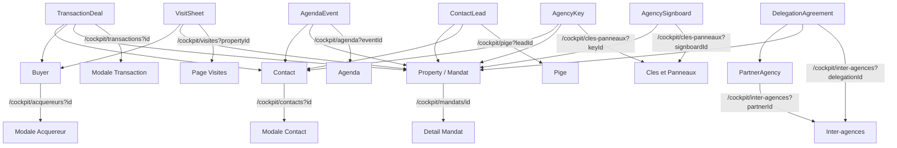

# Plan — Interconnectivité & Redirections des entités

> **Objectif** : « L'interconnectivité est le maître mot. » Partout où une entité est affichée
> (bien/mandat, contact, acquéreur, transaction, visite, partenaire, délégation, clé, panneau,
> document, événement agenda, lead), elle doit être **cliquable** et rediriger vers son détail
> (page dédiée ou modale auto-ouverte).

Ce document est un **plan d'implémentation exécutable par le mode Code**. Il ne contient aucun
changement de code : uniquement l'audit, la convention, la conception du composant réutilisable
et la liste fichier-par-fichier des modifications, organisée en lots priorisés.

---

## 1. Audit — État des lieux

### 1.1 Conventions de deep-link déjà en place

| Cible | Mécanisme existant | Fichier de référence |
|---|---|---|
| Mandat / bien | Route dédiée `/cockpit/mandats/[id]` | [`app/cockpit/mandats/[id]/page.tsx`](../app/cockpit/mandats/%5Bid%5D/page.tsx:20) |
| Contact | Query param `?id=` + auto-ouverture modale | [`app/cockpit/contacts/page.tsx`](../app/cockpit/contacts/page.tsx:18) → [`useContactsState.ts`](../components/cockpit/contacts/useContactsState.ts:22) |
| Visite | Query param `?propertyId=` (préremplissage) | [`useVisitSheetWorkflow.ts`](../components/cockpit/visites/useVisitSheetWorkflow.ts:15) |
| Agenda | Query params `?newVisit=&contactName=&contactPhone=&notes=` | [`app/cockpit/agenda/page.tsx`](../app/cockpit/agenda/page.tsx:25) |
| Acquéreur | Query params `?prefillName=&prefillEmail=&prefillPhone=&prefillNotes=` (création uniquement) | [`app/cockpit/acquereurs/page.tsx`](../app/cockpit/acquereurs/page.tsx:21) |
| Nouveau mandat | Query params `?sellerName=...` | [`app/cockpit/mandats/nouveau`](../components/cockpit/mandats/nouveau/useNewMandateForm.ts:1) |

### 1.2 Liens DÉJÀ fonctionnels (à ne pas casser)

| Composant | Entité liée | Cible |
|---|---|---|
| [`MandateTableRow.tsx`](../components/cockpit/mandats/list/MandateTableRow.tsx:1) | Bien | `/cockpit/mandats/[id]` |
| [`MandatePropertyCard.tsx`](../components/cockpit/mandats/list/MandatePropertyCard.tsx:1) | Bien | `/cockpit/mandats/[id]` |
| [`DiffusionTableRow.tsx`](../components/cockpit/diffusion/DiffusionTableRow.tsx:94) | Bien (réf + visuel) | `/cockpit/mandats/[id]` |
| [`VisitRegisterTable.tsx`](../components/cockpit/visites/VisitRegisterTable.tsx:80) | Bien | `/cockpit/mandats/[id]` |
| [`ListView.tsx`](../components/cockpit/agenda/ListView.tsx:117) | Bien | `/cockpit/mandats/[id]` |
| [`ContactPropertiesTab.tsx`](../components/cockpit/contacts/detail/ContactPropertiesTab.tsx:38) | Bien | `/cockpit/mandats/[id]` |
| [`BuyerCard.tsx`](../components/cockpit/acquereurs/BuyerCard.tsx:159) | Bien (matching) | `/cockpit/mandats/[id]` |
| [`BuyersTable.tsx`](../components/cockpit/acquereurs/BuyersTable.tsx:204) | Bien (matching) | `/cockpit/mandats/[id]` |
| [`ContactLeadCard.tsx`](../components/cockpit/dashboard/leads/ContactLeadCard.tsx:65) | Contact | `/cockpit/contacts?id=` |
| [`EstimationLeadCard.tsx`](../components/cockpit/dashboard/leads/EstimationLeadCard.tsx:74) | Bien / mandat | `/cockpit/avis-de-valeur`, `/cockpit/mandats/nouveau` |
| [`BriefingDayVisits.tsx`](../components/cockpit/dashboard/briefing/BriefingDayVisits.tsx:91) | Visite | `/cockpit/visites?propertyId=` |

### 1.3 Entités affichées SANS lien (à corriger)

| # | Fichier | Entité affichée | Lien manquant vers |
|---|---|---|---|
| A1 | [`DealPartiesCards.tsx`](../components/cockpit/transactions/detail/DealPartiesCards.tsx:12) | `deal.buyer_name` | Acquéreur / contact |
| A2 | [`DealPartiesCards.tsx`](../components/cockpit/transactions/detail/DealPartiesCards.tsx:12) | `deal.seller_notary_name` | Contact (notaire) |
| B1 | [`KanbanBoard.tsx`](../components/cockpit/transactions/KanbanBoard.tsx:15) | Titre du bien | `/cockpit/mandats/[id]` |
| B2 | [`KanbanBoard.tsx`](../components/cockpit/transactions/KanbanBoard.tsx:15) | `deal.buyer_name` | Acquéreur / contact |
| C1 | [`VisitRegisterTable.tsx`](../components/cockpit/visites/VisitRegisterTable.tsx:20) | Nom acquéreur | Acquéreur / contact |
| D1 | [`ListView.tsx`](../components/cockpit/agenda/ListView.tsx:17) | `ev.contactName` | Contact |
| E1 | [`DelegationsTable.tsx`](../components/cockpit/inter-agences/DelegationsTable.tsx:15) | Titre du bien | `/cockpit/mandats/[id]` |
| E2 | [`DelegationsTable.tsx`](../components/cockpit/inter-agences/DelegationsTable.tsx:15) | Nom partenaire | Fiche partenaire |
| E3 | [`PartnersDirectory.tsx`](../components/cockpit/inter-agences/PartnersDirectory.tsx:15) | Carte partenaire | Fiche partenaire |
| F1 | [`KeyCardItem.tsx`](../components/cockpit/cles-panneaux/KeyCardItem.tsx:16) | Titre du bien | `/cockpit/mandats/[id]` |
| F2 | [`KeyCardItem.tsx`](../components/cockpit/cles-panneaux/KeyCardItem.tsx:16) | Nom emprunteur | Contact |
| F3 | [`SignboardGrid.tsx`](../components/cockpit/cles-panneaux/SignboardGrid.tsx:13) | Titre du bien | `/cockpit/mandats/[id]` |
| G1 | [`PigeTable.tsx`](../components/cockpit/pige/PigeTable.tsx:25) | Nom vendeur / titre | Contact / bien |
| G2 | [`LeadCard.tsx`](../components/cockpit/pige/LeadCard.tsx:21) | Nom vendeur / titre | Contact / bien |
| H1 | [`RelanceCard.tsx`](../components/cockpit/relances/RelanceCard.tsx:23) | `action.contactName` | Contact |
| I1 | [`MandateMatchingTab.tsx`](../components/cockpit/mandats/detail/MandateMatchingTab.tsx:36) | Nom acquéreur | Acquéreur |
| J1 | [`BuyerCard.tsx`](../components/cockpit/acquereurs/BuyerCard.tsx:18) | Nom acquéreur | Fiche acquéreur |
| J2 | [`BuyersTable.tsx`](../components/cockpit/acquereurs/BuyersTable.tsx:27) | Nom acquéreur | Fiche acquéreur |
| K1 | [`ReportsHistoryList.tsx`](../components/cockpit/comptes-rendus/ReportsHistoryList.tsx:13) | Bien du compte-rendu | `/cockpit/mandats/[id]` |
| L1 | [`DealDetailModal.tsx`](../components/cockpit/transactions/DealDetailModal.tsx:27) | Titre du bien | `/cockpit/mandats/[id]` |
| M1 | [`MandateDetailHeader.tsx`](../components/cockpit/mandats/detail/MandateDetailHeader.tsx:31) | Vendeur (propriétaire) | Contact |

---

## 2. Convention de deep-link par entité (norme cible)

> **Principe directeur** : on **réutilise** les mécanismes existants. On n'introduit **aucune
> nouvelle route** sauf nécessité démontrée. On privilégie le pattern **query-param + auto-ouverture
> de modale** (déjà éprouvé pour les contacts), plus léger et cohérent.

| Entité | Cible canonique | Mécanisme | Auto-ouverture |
|---|---|---|---|
| **Bien / Mandat** | `/cockpit/mandats/{propertyId}` | Route dédiée | — |
| **Contact** | `/cockpit/contacts?id={contactId}` | Query param | Modale détail via `useContactsState(initialId)` |
| **Acquéreur** | `/cockpit/acquereurs?id={buyerId}` | Query param **(à ajouter)** | Modale détail acquéreur (à créer) |
| **Transaction** | `/cockpit/transactions?id={dealId}` | Query param **(à ajouter)** | `DealDetailModal` auto-ouverte |
| **Visite** | `/cockpit/visites?propertyId={id}` | Query param (existant) | Préremplissage |
| **Partenaire** | `/cockpit/inter-agences?partnerId={id}` | Query param **(à ajouter)** | Panneau/fiche partenaire |
| **Délégation** | `/cockpit/inter-agences?delegationId={id}` | Query param **(à ajouter)** | Surlignage / fiche |
| **Clé** | `/cockpit/cles-panneaux?keyId={id}` | Query param **(à ajouter)** | Fiche clé |
| **Panneau** | `/cockpit/cles-panneaux?signboardId={id}` | Query param **(à ajouter)** | Fiche panneau |
| **Lead (pige)** | `/cockpit/pige?leadId={id}` | Query param **(à ajouter)** | Fiche lead |
| **Événement agenda** | `/cockpit/agenda?eventId={id}` | Query param **(à ajouter)** | Modale événement |
| **Document** | `/cockpit/mandats/{id}?tab=alur_ged` | Query param `tab` | Onglet GED |

### 2.1 Décision sur les routes manquantes

**Décision : PAS de routes dédiées `/cockpit/acquereurs/[id]` ni `/cockpit/transactions/[id]`.**

Justification :
- Les modales de détail existent déjà ([`BuyerSelectionModal`](../components/cockpit/acquereurs/BuyerSelectionModal.tsx:21), [`DealDetailModal`](../components/cockpit/transactions/DealDetailModal.tsx:27)) et sont riches.
- Le pattern `?id=` + auto-ouverture est déjà validé sur les contacts ([`useContactsState.ts`](../components/cockpit/contacts/useContactsState.ts:32)).
- Évite la duplication de logique et respecte la doctrine « god-component » (logique dans hooks).
- Aucune nouvelle dépendance npm.

**Seule exception** : si un jour un partage d'URL « propre » est requis pour un acquéreur, on
pourra ajouter une route dédiée ultérieurement. Ce n'est pas nécessaire aujourd'hui.

---

## 3. Composant réutilisable — `components/ui/EntityLink.tsx`

### 3.1 Rôle

Normaliser **tous** les liens d'entité : style hover cohérent, icône optionnelle, tooltip,
gestion `stopPropagation` (pour ne pas déclencher le clic parent d'une carte/`<tr>`).

### 3.2 Spécification (API)

```tsx
type EntityKind =
  | 'property' | 'contact' | 'buyer' | 'deal'
  | 'visit' | 'partner' | 'delegation'
  | 'key' | 'signboard' | 'lead' | 'event';

interface EntityLinkProps {
  kind: EntityKind;
  id: string;
  children: React.ReactNode;
  /** Affiche une petite icône externe/chevron au survol */
  withIcon?: boolean;
  /** Classes additionnelles */
  className?: string;
  /** Empêche la propagation (cartes cliquables, lignes de tableau) */
  stopPropagation?: boolean;
  /** Tooltip natif */
  title?: string;
}
```

### 3.3 Comportement

- Construit le `href` via une **table de mapping centralisée** `ENTITY_ROUTES` (source unique de vérité).
- Rend un `<Link>` Next.js stylé : `text-inherit hover:text-[#E12B7B] hover:underline underline-offset-2 transition-colors`.
- Si `stopPropagation`, ajoute `onClick={(e) => e.stopPropagation()}`.
- Si `id` est vide/`undefined`, rend un `<span>` neutre (dégradation gracieuse, pas de lien cassé).
- `withIcon` ajoute un chevron discret (`›`) révélé au survol.

### 3.4 Table de mapping (à implémenter dans le composant)

| `kind` | `href` généré |
|---|---|
| `property` | `/cockpit/mandats/${id}` |
| `contact` | `/cockpit/contacts?id=${id}` |
| `buyer` | `/cockpit/acquereurs?id=${id}` |
| `deal` | `/cockpit/transactions?id=${id}` |
| `visit` | `/cockpit/visites?propertyId=${id}` |
| `partner` | `/cockpit/inter-agences?partnerId=${id}` |
| `delegation` | `/cockpit/inter-agences?delegationId=${id}` |
| `key` | `/cockpit/cles-panneaux?keyId=${id}` |
| `signboard` | `/cockpit/cles-panneaux?signboardId=${id}` |
| `lead` | `/cockpit/pige?leadId=${id}` |
| `event` | `/cockpit/agenda?eventId=${id}` |

> **Note** : le composant est **présentationnel** (doctrine god-component). Aucune logique métier.

---

## 4. Plan d'implémentation par lots priorisés

### Lot 0 — Socle (prérequis, à faire en premier)

| # | Fichier | Action |
|---|---|---|
| 0.1 | `components/ui/EntityLink.tsx` | **Créer** le composant + table `ENTITY_ROUTES` (cf. §3) |
| 0.2 | `components/ui/index.ts` (si existe) | Exporter `EntityLink` |
| 0.3 | `app/cockpit/acquereurs/page.tsx` | Lire `?id=` via `useSearchParams`, ouvrir la modale détail acquéreur correspondante |
| 0.4 | `app/cockpit/transactions/page.tsx` | Ajouter `useSearchParams`, lire `?id=`, initialiser `selectedDeal` depuis `transactions` |
| 0.5 | `app/cockpit/inter-agences/page.tsx` | Lire `?partnerId=` / `?delegationId=` (surlignage ou fiche) |
| 0.6 | `app/cockpit/cles-panneaux/page.tsx` | Lire `?keyId=` / `?signboardId=` |
| 0.7 | `app/cockpit/pige/page.tsx` | Lire `?leadId=` |
| 0.8 | `app/cockpit/agenda/page.tsx` | Lire `?eventId=` et ouvrir la modale événement |

> **Important** : les pages utilisant `useSearchParams` doivent être encapsulées dans un
> `<Suspense>` (pattern déjà appliqué dans [`app/cockpit/acquereurs/page.tsx`](../app/cockpit/acquereurs/page.tsx:127)).

### Lot 1 — Biens / Mandats (impact maximal)

| # | Fichier | Zone | Modification |
|---|---|---|---|
| 1.1 | [`KanbanBoard.tsx`](../components/cockpit/transactions/KanbanBoard.tsx:15) | Titre du bien sur carte deal | Envelopper le titre dans `<EntityLink kind="property" id={deal.property_id} stopPropagation />` |
| 1.2 | [`DealDetailModal.tsx`](../components/cockpit/transactions/DealDetailModal.tsx:27) | En-tête | Lier le titre du bien vers `/cockpit/mandats/[id]` |
| 1.3 | [`DelegationsTable.tsx`](../components/cockpit/inter-agences/DelegationsTable.tsx:15) | Colonne bien | `<EntityLink kind="property" id={d.property_id} />` |
| 1.4 | [`KeyCardItem.tsx`](../components/cockpit/cles-panneaux/KeyCardItem.tsx:16) | Titre bien | `<EntityLink kind="property" id={key.property_id} />` |
| 1.5 | [`SignboardGrid.tsx`](../components/cockpit/cles-panneaux/SignboardGrid.tsx:13) | Titre bien | `<EntityLink kind="property" id={sign.property_id} />` |
| 1.6 | [`ReportsHistoryList.tsx`](../components/cockpit/comptes-rendus/ReportsHistoryList.tsx:13) | Ligne rapport | Lier le bien du compte-rendu |
| 1.7 | [`PigeTable.tsx`](../components/cockpit/pige/PigeTable.tsx:25) | Colonne bien | Lier le bien si `property_id` présent |
| 1.8 | [`LeadCard.tsx`](../components/cockpit/pige/LeadCard.tsx:21) | Titre bien | Lier le bien si `property_id` présent |

### Lot 2 — Contacts

| # | Fichier | Zone | Modification |
|---|---|---|---|
| 2.1 | [`DealPartiesCards.tsx`](../components/cockpit/transactions/detail/DealPartiesCards.tsx:12) | Nom acquéreur | `<EntityLink kind="contact" id={deal.buyer_contact_id} />` (fallback texte si absent) |
| 2.2 | [`DealPartiesCards.tsx`](../components/cockpit/transactions/detail/DealPartiesCards.tsx:12) | Nom notaire | `<EntityLink kind="contact" id={deal.seller_notary_contact_id} />` |
| 2.3 | [`ListView.tsx`](../components/cockpit/agenda/ListView.tsx:17) | `ev.contactName` | `<EntityLink kind="contact" id={ev.contactId} />` |
| 2.4 | [`RelanceCard.tsx`](../components/cockpit/relances/RelanceCard.tsx:23) | `action.contactName` | `<EntityLink kind="contact" id={action.contactId} />` |
| 2.5 | [`KeyCardItem.tsx`](../components/cockpit/cles-panneaux/KeyCardItem.tsx:16) | Nom emprunteur | `<EntityLink kind="contact" id={loan.borrower_contact_id} />` |
| 2.6 | [`MandateDetailHeader.tsx`](../components/cockpit/mandats/detail/MandateDetailHeader.tsx:31) | Vendeur | Afficher + lier le contact vendeur |
| 2.7 | [`PigeTable.tsx`](../components/cockpit/pige/PigeTable.tsx:25) | Nom vendeur | Lier le contact si `contact_id` présent |
| 2.8 | [`LeadCard.tsx`](../components/cockpit/pige/LeadCard.tsx:21) | Nom vendeur | Lier le contact si `contact_id` présent |

### Lot 3 — Acquéreurs

| # | Fichier | Zone | Modification |
|---|---|---|---|
| 3.1 | [`BuyerCard.tsx`](../components/cockpit/acquereurs/BuyerCard.tsx:18) | Nom acquéreur | `<EntityLink kind="buyer" id={buyer.id} stopPropagation />` |
| 3.2 | [`BuyersTable.tsx`](../components/cockpit/acquereurs/BuyersTable.tsx:27) | Nom acquéreur | `<EntityLink kind="buyer" id={buyer.id} stopPropagation />` |
| 3.3 | [`VisitRegisterTable.tsx`](../components/cockpit/visites/VisitRegisterTable.tsx:20) | Nom acquéreur | `<EntityLink kind="buyer" id={v.buyer_id} />` |
| 3.4 | [`MandateMatchingTab.tsx`](../components/cockpit/mandats/detail/MandateMatchingTab.tsx:36) | Nom acquéreur matché | `<EntityLink kind="buyer" id={buyer.id} />` |
| 3.5 | [`KanbanBoard.tsx`](../components/cockpit/transactions/KanbanBoard.tsx:15) | `deal.buyer_name` | `<EntityLink kind="buyer" id={deal.buyer_id} stopPropagation />` |

### Lot 4 — Transactions

| # | Fichier | Zone | Modification |
|---|---|---|---|
| 4.1 | [`DealPartiesCards.tsx`](../components/cockpit/transactions/detail/DealPartiesCards.tsx:12) | Référence deal | Lier vers `/cockpit/transactions?id={deal.id}` |
| 4.2 | [`DealDetailModal.tsx`](../components/cockpit/transactions/DealDetailModal.tsx:27) | — | Vérifier cohérence deep-link `?id=` |

### Lot 5 — Visites / Agenda

| # | Fichier | Zone | Modification |
|---|---|---|---|
| 5.1 | [`ListView.tsx`](../components/cockpit/agenda/ListView.tsx:17) | Événement | Lier l'événement vers `/cockpit/agenda?eventId={ev.id}` |
| 5.2 | [`BriefingDayVisits.tsx`](../components/cockpit/dashboard/briefing/BriefingDayVisits.tsx:14) | Visite | Ajouter lien acquéreur en complément du lien bien existant |
| 5.3 | [`VisitRegisterTable.tsx`](../components/cockpit/visites/VisitRegisterTable.tsx:20) | Ligne visite | Lier la visite vers `/cockpit/visites?propertyId=` (déjà OK) — vérifier cohérence |

### Lot 6 — Inter-agences / Clés / Panneaux

| # | Fichier | Zone | Modification |
|---|---|---|---|
| 6.1 | [`PartnersDirectory.tsx`](../components/cockpit/inter-agences/PartnersDirectory.tsx:15) | Carte partenaire | `<EntityLink kind="partner" id={p.id} />` |
| 6.2 | [`DelegationsTable.tsx`](../components/cockpit/inter-agences/DelegationsTable.tsx:15) | Nom partenaire | `<EntityLink kind="partner" id={d.partner_id} />` |
| 6.3 | [`DelegationsTable.tsx`](../components/cockpit/inter-agences/DelegationsTable.tsx:15) | Réf délégation | `<EntityLink kind="delegation" id={d.id} />` |
| 6.4 | [`KeyCardItem.tsx`](../components/cockpit/cles-panneaux/KeyCardItem.tsx:16) | Réf clé | `<EntityLink kind="key" id={key.id} />` |
| 6.5 | [`SignboardGrid.tsx`](../components/cockpit/cles-panneaux/SignboardGrid.tsx:13) | Réf panneau | `<EntityLink kind="signboard" id={sign.id} />` |

### Lot 7 — Leads / Pige / Diffusion

| # | Fichier | Zone | Modification |
|---|---|---|---|
| 7.1 | [`PigeTable.tsx`](../components/cockpit/pige/PigeTable.tsx:25) | Réf lead | `<EntityLink kind="lead" id={lead.id} />` |
| 7.2 | [`LeadCard.tsx`](../components/cockpit/pige/LeadCard.tsx:21) | Réf lead | `<EntityLink kind="lead" id={lead.id} />` |
| 7.3 | [`ContactLeadCard.tsx`](../components/cockpit/dashboard/leads/ContactLeadCard.tsx:15) | — | Vérifier cohérence (déjà lié) |
| 7.4 | [`EstimationLeadCard.tsx`](../components/cockpit/dashboard/leads/EstimationLeadCard.tsx:14) | — | Vérifier cohérence (déjà lié) |

---

## 5. Graphe d'interconnexion cible



---

## 6. Contraintes & garde-fous

1. **Ne pas casser les liens existants** (cf. §1.2) — vérifier chaque fichier avant modification.
2. **Doctrine god-component** : la logique de deep-link (lecture `useSearchParams`, résolution
   d'entité) reste dans les **hooks** (`useContactsState`, `useVisitSheetWorkflow`, etc.) ou dans
   de nouveaux hooks dédiés. Les composants restent présentationnels.
3. **Aucune nouvelle dépendance npm.**
4. **localStorage-first** : ne pas introduire d'appel réseau pour la résolution d'entité.
5. **`stopPropagation`** obligatoire pour les liens placés dans des cartes/lignes cliquables
   (KanbanBoard, BuyerCard, BuyersTable, lignes de tableau).
6. **Dégradation gracieuse** : si l'`id` cible est absent, `EntityLink` rend un `<span>` neutre.
7. **Suspense** : toute page consommant `useSearchParams` doit être encapsulée dans `<Suspense>`.
8. **Accessibilité** : conserver un `title` explicite et un contraste suffisant au survol.

---

## 7. Checklist d'implémentation

### Lot 0 — Socle
- [ ] Créer `components/ui/EntityLink.tsx` avec la table `ENTITY_ROUTES`
- [ ] Exporter `EntityLink` depuis l'index UI
- [ ] `app/cockpit/acquereurs/page.tsx` : lire `?id=` et ouvrir la modale détail
- [ ] `app/cockpit/transactions/page.tsx` : lire `?id=` et initialiser `selectedDeal`
- [ ] `app/cockpit/inter-agences/page.tsx` : lire `?partnerId=` / `?delegationId=`
- [ ] `app/cockpit/cles-panneaux/page.tsx` : lire `?keyId=` / `?signboardId=`
- [ ] `app/cockpit/pige/page.tsx` : lire `?leadId=`
- [ ] `app/cockpit/agenda/page.tsx` : lire `?eventId=` et ouvrir la modale

### Lot 1 — Biens / Mandats
- [ ] `KanbanBoard.tsx` : titre bien cliquable
- [ ] `DealDetailModal.tsx` : titre bien cliquable
- [ ] `DelegationsTable.tsx` : bien cliquable
- [ ] `KeyCardItem.tsx` : bien cliquable
- [ ] `SignboardGrid.tsx` : bien cliquable
- [ ] `ReportsHistoryList.tsx` : bien cliquable
- [ ] `PigeTable.tsx` : bien cliquable
- [ ] `LeadCard.tsx` : bien cliquable

### Lot 2 — Contacts
- [ ] `DealPartiesCards.tsx` : acquéreur cliquable
- [ ] `DealPartiesCards.tsx` : notaire cliquable
- [ ] `ListView.tsx` : contact cliquable
- [ ] `RelanceCard.tsx` : contact cliquable
- [ ] `KeyCardItem.tsx` : emprunteur cliquable
- [ ] `MandateDetailHeader.tsx` : vendeur affiché + cliquable
- [ ] `PigeTable.tsx` : vendeur cliquable
- [ ] `LeadCard.tsx` : vendeur cliquable

### Lot 3 — Acquéreurs
- [ ] `BuyerCard.tsx` : nom cliquable
- [ ] `BuyersTable.tsx` : nom cliquable
- [ ] `VisitRegisterTable.tsx` : acquéreur cliquable
- [ ] `MandateMatchingTab.tsx` : acquéreur cliquable
- [ ] `KanbanBoard.tsx` : acquéreur cliquable

### Lot 4 — Transactions
- [ ] `DealPartiesCards.tsx` : réf deal cliquable
- [ ] `DealDetailModal.tsx` : cohérence deep-link

### Lot 5 — Visites / Agenda
- [ ] `ListView.tsx` : événement cliquable
- [ ] `BriefingDayVisits.tsx` : acquéreur cliquable
- [ ] `VisitRegisterTable.tsx` : cohérence visite

### Lot 6 — Inter-agences / Clés / Panneaux
- [ ] `PartnersDirectory.tsx` : partenaire cliquable
- [ ] `DelegationsTable.tsx` : partenaire cliquable
- [ ] `DelegationsTable.tsx` : délégation cliquable
- [ ] `KeyCardItem.tsx` : clé cliquable
- [ ] `SignboardGrid.tsx` : panneau cliquable

### Lot 7 — Leads / Pige / Diffusion
- [ ] `PigeTable.tsx` : lead cliquable
- [ ] `LeadCard.tsx` : lead cliquable
- [ ] `ContactLeadCard.tsx` : vérification cohérence
- [ ] `EstimationLeadCard.tsx` : vérification cohérence

### Validation finale
- [ ] Aucun lien existant cassé (revue §1.2)
- [ ] Tous les `EntityLink` dans des cartes/lignes ont `stopPropagation`
- [ ] Toutes les pages `useSearchParams` encapsulées dans `<Suspense>`
- [ ] Aucune nouvelle dépendance npm ajoutée
- [ ] Build Next.js sans erreur (`npm run build`)
