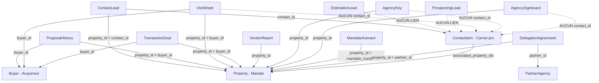

# Nell'Immo — Interconnexions & Optimisations

> Objectif : faire gagner du temps au quotidien en reliant les modules déjà existants,
> **sans surcharger l'application** (pas de nouvelle librairie, pas de polling, pas de duplication de données, pas de refonte).
>
> Principe directeur : **réutiliser** le store central ([`lib/store.tsx`](lib/store.tsx:1)), les helpers existants
> ([`lib/gmail.ts`](lib/gmail.ts:1), [`lib/google.ts`](lib/google.ts:1), [`lib/dvf.ts`](lib/dvf.ts:1), [`lib/compliance.ts`](lib/compliance.ts:1))
> et le moteur de relances pur ([`lib/relances.ts`](lib/relances.ts:1)).

---

## 1. Cartographie des entités et de leurs liens

### 1.1 Vue d'ensemble du graphe

### 1.2 Clés étrangères **existantes** (déjà en place)

| Entité | Champ(s) de liaison | Cible | Fichier de référence |
|---|---|---|---|
| [`PropertyImage`](lib/types.ts:11) | `property_id` | Property | [`lib/types.ts`](lib/types.ts:11) |
| [`PropertyDocument`](lib/types.ts:120) | `property_id` | Property | [`lib/types.ts`](lib/types.ts:120) |
| [`VisitSheet`](lib/types.ts:170) | `property_id`, `buyer_id` | Property, Buyer | [`lib/types.ts`](lib/types.ts:170) |
| [`TransactionDeal`](lib/types.ts:253) | `property_id`, `buyer_id` | Property, Buyer | [`lib/types.ts`](lib/types.ts:253) |
| [`VendorReport`](lib/types.ts:491) | `property_id` | Property | [`lib/types.ts`](lib/types.ts:491) |
| [`AgencyKey`](lib/types.ts:538) | `property_id` | Property | [`lib/types.ts`](lib/types.ts:538) |
| [`AgencySignboard`](lib/types.ts:556) | `property_id?` | Property | [`lib/types.ts`](lib/types.ts:556) |
| [`MandateAvenant`](lib/types.ts:576) | `mandate_number`, `property_id` | Property | [`lib/types.ts`](lib/types.ts:576) |
| [`ProposalHistory`](lib/types.ts:604) | `property_id`, `buyer_id` | Property, Buyer | [`lib/types.ts`](lib/types.ts:604) |
| [`DelegationAgreement`](lib/types.ts:631) | `property_id`, `partner_id` | Property, PartnerAgency | [`lib/types.ts`](lib/types.ts:631) |
| [`KeyLoanRecord`](lib/types.ts:523) | `key_id` | AgencyKey | [`lib/types.ts`](lib/types.ts:523) |
| [`ContactInteraction`](lib/types.ts:699) | `contact_id` | ContactItem | [`lib/types.ts`](lib/types.ts:699) |
| [`ContactItem`](lib/types.ts:717) | `associated_property_ids[]` | Property (N-N) | [`lib/types.ts`](lib/types.ts:717) |
| [`ContactLead`](lib/types.ts:420) | `property_id?`, `reference?`, `contact_id?`, `source?` | Property, ContactItem | [`lib/types.ts`](lib/types.ts:420) |

### 1.3 Liens **manquants** identifiés (opportunités d'interconnexion)

| Entité | Lien manquant | Impact quotidien |
|---|---|---|
| [`EstimationLead`](lib/types.ts:439) | Aucun `contact_id` | Un vendeur qui demande une estimation n'apparaît jamais dans le carnet pro → double saisie. |
| [`ProspectingLead`](lib/types.ts:459) | Aucun `contact_id` | Le vendeur de pige (LeBonCoin/PAP) n'est pas relié à sa fiche contact → perte de l'historique d'appels. |
| [`VisitSheet`](lib/types.ts:170) | Aucun `contact_id` | Le bon de visite n'alimente pas la timeline du contact → pas de trace « visite effectuée ». |
| [`AgencyKey`](lib/types.ts:538) | Aucun `contact_id` sur `KeyLoanRecord` | Le prêteur (artisan/diagnostiqueur/confrère) n'est pas relié à sa fiche → pas d'historique de prêt. |
| [`AgencySignboard`](lib/types.ts:556) | Aucun `contact_id` | Pas de lien vers l'installateur / le poseur. |
| [`TransactionDeal`](lib/types.ts:253) | Notaire non relié à un `contact_id` | Le notaire est synchronisé par nom (fragile) dans [`syncContactsFromActivity()`](lib/store.tsx:1265). |
| [`VendorReport`](lib/types.ts:491) | Pas de trace d'envoi dans la timeline contact | On ne sait pas si le vendeur a bien reçu son compte-rendu. |
| [`QuickCallModal`](components/cockpit/dashboard/QuickCallModal.tsx:15) | N'appelle pas `upsertContactFromLead` | Un appel entrant crée un buyer + un lead mais **pas** de fiche carnet pro unifiée. |
| [`syncContactsFromActivity()`](lib/store.tsx:1265) | Non déclenché automatiquement | La synchro existe mais doit être lancée manuellement → fiches manquantes. |
| Supabase sync | Ne couvre pas transactions, keys, signboards, avenants, proposals, partners, delegations, contacts | Risque de divergence multi-appareils sur ces entités. |

---

## 2. Optimisations d'interconnexion priorisées

> Légende effort : **S** = petit (1 fichier, quelques lignes) · **M** = moyen (2-3 fichiers) · **L** = plus large.
> Le « temps gagné » est une estimation qualitative d'usage quotidien, pas une durée de développement.

### Priorité 1 — ROI fort / risque faible

#### O1. Brancher `upsertContactFromLead` dans `QuickCallModal`
- **Problème quotidien** : un appel entrant crée un acquéreur + un lead, mais le carnet pro ne garde aucune trace unifiée → on ressaisit ou on perd le fil.
- **Solution minimale** : après `createBuyer` + `addContactLead`, appeler `upsertContactFromLead({ name, email, phone, message, source: 'appel', propertyId })` puis renseigner `contact_id` sur le lead.
- **Fichiers** : [`components/cockpit/dashboard/QuickCallModal.tsx`](components/cockpit/dashboard/QuickCallModal.tsx:60)
- **Effort** : S
- **Temps gagné** : élevé (chaque appel entrant devient une fiche exploitable).

#### O2. Brancher `upsertContactFromLead` dans `EstimationLead`
- **Problème quotidien** : une demande d'estimation (vendeur) ne crée pas de contact → double saisie dans le carnet.
- **Solution minimale** : dans [`addEstimationLead`](lib/store.tsx:748), appeler `upsertContactFromLead` avec `source: 'estimation'` et stocker le `contact_id` retourné (ajout d'un champ optionnel `contact_id?` sur [`EstimationLead`](lib/types.ts:439)).
- **Fichiers** : [`lib/store.tsx`](lib/store.tsx:748), [`lib/types.ts`](lib/types.ts:439)
- **Effort** : S
- **Temps gagné** : élevé.

#### O3. Brancher `upsertContactFromLead` dans `ProspectingLead`
- **Problème quotidien** : le vendeur de pige n'est pas relié à une fiche contact → historique d'appels dispersé.
- **Solution minimale** : dans [`createProspectingLead`](lib/store.tsx:882), appeler `upsertContactFromLead` avec `source: 'pige'` + `propertyTitle`, et stocker `contact_id?` sur [`ProspectingLead`](lib/types.ts:459).
- **Fichiers** : [`lib/store.tsx`](lib/store.tsx:882), [`lib/types.ts`](lib/types.ts:459)
- **Effort** : S
- **Temps gagné** : élevé.

#### O4. Alimenter la timeline contact à la sauvegarde d'un bon de visite
- **Problème quotidien** : après une visite, aucune trace dans la fiche contact → on ne sait plus qui a visité quoi.
- **Solution minimale** : dans [`handleSaveVisit`](components/cockpit/visites/useVisitSheetWorkflow.ts:60), après `createVisitSheet`, appeler `addContactInteraction` sur le contact lié au buyer (via `upsertContactFromLead` si absent) avec `type: 'rdv'` et le libellé du bien.
- **Fichiers** : [`components/cockpit/visites/useVisitSheetWorkflow.ts`](components/cockpit/visites/useVisitSheetWorkflow.ts:60)
- **Effort** : S
- **Temps gagné** : moyen-élevé.

#### O5. Déclencher `syncContactsFromActivity()` automatiquement (une fois par session)
- **Problème quotidien** : la synchro existe mais reste manuelle → fiches acquéreurs/vendeurs/notaires manquantes.
- **Solution minimale** : appeler `syncContactsFromActivity()` dans un `useEffect` au montage du dashboard ([`app/cockpit/page.tsx`](app/cockpit/page.tsx:16)), protégé par un flag `sessionStorage` pour ne pas le refaire à chaque navigation.
- **Fichiers** : [`app/cockpit/page.tsx`](app/cockpit/page.tsx:16)
- **Effort** : S
- **Temps gagné** : élevé (carnet pro toujours à jour sans action).

### Priorité 2 — ROI moyen / risque faible

#### O6. Relier le notaire d'une transaction à un `contact_id`
- **Problème quotidien** : la synchro notaire se fait par correspondance de nom (fragile) dans [`syncContactsFromActivity()`](lib/store.tsx:1265).
- **Solution minimale** : ajouter `seller_notary_contact_id?` sur [`TransactionDeal`](lib/types.ts:253) et le renseigner via `upsertContactFromLead` lors de la création/mise à jour de la transaction.
- **Fichiers** : [`lib/types.ts`](lib/types.ts:253), [`lib/store.tsx`](lib/store.tsx:806)
- **Effort** : M
- **Temps gagné** : moyen.

#### O7. Relier le prêteur de clé à un `contact_id`
- **Problème quotidien** : un artisan/confrère qui emprunte un trousseau n'est pas relié à sa fiche → pas d'historique.
- **Solution minimale** : ajouter `borrower_contact_id?` sur [`KeyLoanRecord`](lib/types.ts:523) et le renseigner dans [`borrowKey`](lib/store.tsx:957) via `upsertContactFromLead`.
- **Fichiers** : [`lib/types.ts`](lib/types.ts:523), [`lib/store.tsx`](lib/store.tsx:957)
- **Effort** : M
- **Temps gagné** : moyen.

#### O8. Tracer l'envoi d'un compte-rendu vendeur dans la timeline contact
- **Problème quotidien** : on ne sait pas si le vendeur a reçu son compte-rendu.
- **Solution minimale** : après `handleSendWhatsapp` / envoi email dans [`useVendorReportState`](components/cockpit/comptes-rendus/page.tsx:12), appeler `addContactInteraction` sur le contact vendeur (via `associated_property_ids`).
- **Fichiers** : [`components/cockpit/comptes-rendus/useVendorReportState.ts`](components/cockpit/comptes-rendus/useVendorReportState.ts:1)
- **Effort** : S
- **Temps gagné** : moyen.

#### O9. Exposer les relances dans la fiche contact
- **Problème quotidien** : les relances calculées ([`computeRelances`](lib/relances.ts:252)) ne sont visibles que sur la page Relances, pas dans la fiche contact.
- **Solution minimale** : dans le détail contact, filtrer `computeRelances(...)` par `contact_id`/`buyer_id` et afficher les actions liées. Réutilise le moteur pur existant.
- **Fichiers** : [`components/cockpit/contacts/ContactDetailModal.tsx`](components/cockpit/contacts/ContactDetailModal.tsx:1), [`lib/relances.ts`](lib/relances.ts:252)
- **Effort** : M
- **Temps gagné** : moyen-élevé.

### Priorité 3 — ROI ciblé / à valider

#### O10. Étendre la synchro Supabase aux entités non couvertes
- **Problème quotidien** : transactions, clés, panneaux, avenants, propositions, partenaires, délégations, contacts ne sont pas synchronisés → divergence multi-appareils.
- **Solution minimale** : ajouter les tables manquantes au `useEffect` de chargement Supabase dans [`lib/store.tsx`](lib/store.tsx:316), en réutilisant le pattern existant.
- **Fichiers** : [`lib/store.tsx`](lib/store.tsx:316), `supabase/`
- **Effort** : L
- **Temps gagné** : moyen (fiabilité plus que temps).

#### O11. Relier un panneau à son poseur (`contact_id`)
- **Problème quotidien** : pas de lien vers l'installateur du panneau.
- **Solution minimale** : ajouter `installer_contact_id?` sur [`AgencySignboard`](lib/types.ts:556).
- **Fichiers** : [`lib/types.ts`](lib/types.ts:556)
- **Effort** : S
- **Temps gagné** : faible-moyen.

---

## 3. Quick wins — réutilisation de l'existant

Ces optimisations ne créent **aucune** nouvelle logique métier : elles branchent des fonctions déjà écrites.

| Fonction existante | Où elle est définie | À brancher dans |
|---|---|---|
| [`upsertContactFromLead()`](lib/store.tsx:1174) | [`lib/store.tsx`](lib/store.tsx:1174) | [`QuickCallModal`](components/cockpit/dashboard/QuickCallModal.tsx:60), [`addEstimationLead`](lib/store.tsx:748), [`createProspectingLead`](lib/store.tsx:882), [`borrowKey`](lib/store.tsx:957) |
| [`addContactInteraction()`](lib/store.tsx:1149) | [`lib/store.tsx`](lib/store.tsx:1149) | [`useVisitSheetWorkflow`](components/cockpit/visites/useVisitSheetWorkflow.ts:60), [`useVendorReportState`](components/cockpit/comptes-rendus/useVendorReportState.ts:1) |
| [`syncContactsFromActivity()`](lib/store.tsx:1265) | [`lib/store.tsx`](lib/store.tsx:1265) | [`app/cockpit/page.tsx`](app/cockpit/page.tsx:16) (au montage, 1×/session) |
| [`computeRelances()`](lib/relances.ts:252) | [`lib/relances.ts`](lib/relances.ts:252) | [`ContactDetailModal`](components/cockpit/contacts/ContactDetailModal.tsx:1) |
| [`createGmailComposeUrl()`](lib/gmail.ts:15) / [`openGmailCompose()`](lib/gmail.ts:33) | [`lib/gmail.ts`](lib/gmail.ts:15) | Déjà utilisé dans [`ContactLeadCard`](components/cockpit/dashboard/leads/ContactLeadCard.tsx:15) |
| [`createGoogleCalendarUrl()`](lib/google.ts:206) | [`lib/google.ts`](lib/google.ts:206) | Déjà utilisé dans l'agenda et les relances |
| [`auditPropertyCompliance()`](lib/compliance.ts:25) | [`lib/compliance.ts`](lib/compliance.ts:25) | Déjà utilisé dans le dashboard ([`UrgentAlertsWidget`](components/cockpit/dashboard/UrgentAlertsWidget.tsx:22)) |
| [`fetchDvfTransactions()`](lib/dvf.ts:116) | [`lib/dvf.ts`](lib/dvf.ts:116) | Déjà utilisé dans [`avis-de-valeur`](app/cockpit/avis-de-valeur/page.tsx:16) et la pige |

**Pattern de référence déjà en place** : [`createMandateAvenant`](lib/store.tsx:1020) synchronise automatiquement prix/date de fin vers la propriété — c'est le modèle à reproduire pour les autres interconnexions.

---

## 4. Plan d'implémentation par lots

### Lot 1 — Quick wins « carnet pro unifié » (priorité 1)
Ordre d'exécution :
1. [`QuickCallModal.tsx`](components/cockpit/dashboard/QuickCallModal.tsx:60) → appeler `upsertContactFromLead` + lier `contact_id` au lead.
2. [`lib/types.ts`](lib/types.ts:439) → ajouter `contact_id?` sur `EstimationLead` et `ProspectingLead`.
3. [`lib/store.tsx`](lib/store.tsx:748) → brancher `upsertContactFromLead` dans `addEstimationLead`.
4. [`lib/store.tsx`](lib/store.tsx:882) → brancher `upsertContactFromLead` dans `createProspectingLead`.
5. [`useVisitSheetWorkflow.ts`](components/cockpit/visites/useVisitSheetWorkflow.ts:60) → `addContactInteraction` après sauvegarde du bon de visite.
6. [`app/cockpit/page.tsx`](app/cockpit/page.tsx:16) → déclencher `syncContactsFromActivity()` 1×/session.

**Fichiers touchés** : 5 · **Risque** : faible (aucune nouvelle dépendance).

### Lot 2 — Traçabilité & relances contextuelles (priorité 2)
Ordre d'exécution :
1. [`lib/types.ts`](lib/types.ts:253) → `seller_notary_contact_id?` sur `TransactionDeal`.
2. [`lib/store.tsx`](lib/store.tsx:806) → renseigner le notaire via `upsertContactFromLead`.
3. [`lib/types.ts`](lib/types.ts:523) → `borrower_contact_id?` sur `KeyLoanRecord`.
4. [`lib/store.tsx`](lib/store.tsx:957) → renseigner le prêteur via `upsertContactFromLead`.
5. [`useVendorReportState.ts`](components/cockpit/comptes-rendus/useVendorReportState.ts:1) → `addContactInteraction` à l'envoi du compte-rendu.
6. [`ContactDetailModal.tsx`](components/cockpit/contacts/ContactDetailModal.tsx:1) → afficher les relances filtrées via `computeRelances`.

**Fichiers touchés** : 5 · **Risque** : faible-moyen.

### Lot 3 — Fiabilité multi-appareils (priorité 3)
Ordre d'exécution :
1. [`lib/store.tsx`](lib/store.tsx:316) → étendre la synchro Supabase aux entités manquantes.
2. `supabase/` → migrations des tables correspondantes.
3. [`lib/types.ts`](lib/types.ts:556) → `installer_contact_id?` sur `AgencySignboard`.

**Fichiers touchés** : 3+ · **Risque** : moyen (schéma Supabase).

---

## 5. Garde-fous anti-surcharge

### À NE PAS faire
- ❌ **Ajouter une librairie externe** (state manager, ORM, date-lib) : le store central + helpers suffisent.
- ❌ **Mettre en place du polling / websockets supplémentaires** : la synchro Supabase existante est déjà optionnelle et ponctuelle.
- ❌ **Dupliquer les données** entre entités (ex. copier l'email du contact dans le lead) : on stocke uniquement l'`id` de liaison.
- ❌ **Refactorer le store** ou découper [`lib/store.tsx`](lib/store.tsx:1) : on ajoute des appels, on ne restructure pas.
- ❌ **Créer des composants « god »** : respecter la doctrine existante (logique dans les hooks `use*`, présentation dans les composants).
- ❌ **Bloquer le rendu** : toute synchro (`syncContactsFromActivity`) doit rester non bloquante et idempotente.
- ❌ **Multiplier les `useEffect` de synchro** : un seul déclenchement par session, protégé par un flag.

### À FAIRE
- ✅ **Réutiliser** `upsertContactFromLead`, `addContactInteraction`, `syncContactsFromActivity`, `computeRelances`.
- ✅ **Stocker des `id`** de liaison (pas de copie de données).
- ✅ **Rendre les synchros idempotentes** (déduplication par téléphone/email déjà gérée dans [`upsertContactFromLead`](lib/store.tsx:1174)).
- ✅ **Garder les helpers purs** ([`lib/relances.ts`](lib/relances.ts:1), [`lib/compliance.ts`](lib/compliance.ts:1), [`lib/dvf.ts`](lib/dvf.ts:1)) sans dépendance React.
- ✅ **Suivre le pattern existant** de [`createMandateAvenant`](lib/store.tsx:1020) pour toute nouvelle propagation inter-modules.
- ✅ **Tester chaque lot isolément** avant de passer au suivant.

---

## Synthèse

| Lot | Optimisations | Effort global | Gain quotidien |
|---|---|---|---|
| Lot 1 | O1–O5 | Faible | Élevé — carnet pro unifié automatiquement |
| Lot 2 | O6–O9 | Moyen | Moyen-élevé — traçabilité & relances contextuelles |
| Lot 3 | O10–O11 | Moyen-élevé | Fiabilité multi-appareils |

**Recommandation** : démarrer par le **Lot 1** — il ne touche que 5 fichiers, ne crée aucune dépendance, et transforme chaque appel/lead/visite en fiche contact exploitable.
