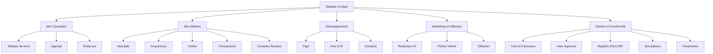

# Refonte Navigation & Élimination des Doublons — Cockpit Nell'Immo

> **Objectif** : Rendre le Cockpit simple, clair et professionnel. Supprimer les doublons, éliminer les pages orphelines, garantir que Nelly retrouve tout facilement.
> **Approche retenue** : **Agressive** — suppression réelle des pages redondantes, en préservant les fonctionnalités réellement utiles.
> **Date** : 2026-09-10

---

## 1. Diagnostic — État actuel

### 1.1 Le problème central

Le Cockpit compte **25 routes** mais la sidebar n'en expose que **12**. Résultat : **13 pages sont orphelines** (accessibles uniquement via Ctrl+K, donc invisibles pour Nelly).

| Route | Dans la sidebar ? | Statut |
| :--- | :---: | :--- |
| `/cockpit` | ✅ | OK |
| `/cockpit/agenda` | ✅ | OK |
| `/cockpit/relances` | ✅ | OK |
| `/cockpit/mandats` | ✅ | OK |
| `/cockpit/acquereurs` | ✅ | OK |
| `/cockpit/visites` | ✅ | OK |
| `/cockpit/transactions` | ✅ | OK |
| `/cockpit/pige` | ✅ | OK |
| `/cockpit/avis-de-valeur` | ✅ | OK |
| `/cockpit/contacts` | ✅ | OK |
| `/cockpit/redacteur` | ✅ | OK (mais mal nommé « Marketing & Diffusion ») |
| `/cockpit/simulateurs` | ✅ | OK |
| `/cockpit/parametres` | ✅ | OK |
| `/cockpit/fiches-vitrine` | ❌ | **ORPHELIN** |
| `/cockpit/diffusion` | ❌ | **ORPHELIN** |
| `/cockpit/reseaux-sociaux` | ❌ | **ORPHELIN + DOUBLON** |
| `/cockpit/comptes-rendus` | ❌ | **ORPHELIN** |
| `/cockpit/lab` | ❌ | **ORPHELIN + gadget** |
| `/cockpit/registre-dgccrf` | ❌ | **ORPHELIN** |
| `/cockpit/cles-panneaux` | ❌ | **ORPHELIN** |
| `/cockpit/inter-agences` | ❌ | **ORPHELIN** |
| `/cockpit/analytics` | ❌ | **ORPHELIN + DOUBLON** |
| `/cockpit/import-hektor` | ❌ | **ORPHELIN** |
| `/cockpit/base-de-donnees` | ❌ | **ORPHELIN + DOUBLON** |
| `/cockpit/aide` | ❌ | **ORPHELIN + DOUBLON** |

### 1.2 Doublons identifiés

| # | Doublon | Détail | Décision |
| :--- | :--- | :--- | :--- |
| D1 | `reseaux-sociaux` ↔ `redacteur` | Les deux génèrent du contenu social. `redacteur` possède déjà `handlePublishToMeta`. | **SUPPRIMER** `reseaux-sociaux` |
| D2 | `base-de-donnees` ↔ `parametres` | `BackupSection` fait déjà export/restauration. `base-de-donnees` duplique l'export + expose les collections brutes. | **SUPPRIMER** `base-de-donnees` (relocaliser Télémétrie) |
| D3 | `analytics` ↔ `cockpit` (Dashboard) | Le Dashboard affiche déjà KPIs, funnel, alertes. `analytics` est une vue redondante. | **SUPPRIMER** `analytics` |
| D4 | `aide` ↔ `ContextualHelpDrawer` | Les deux rendent `HELP_GUIDES`. Le tiroir contextuel est supérieur (contextuel par page). | **SUPPRIMER** la page `aide` |
| D5 | `lab` ↔ `redacteur` | Le Lab est un « bac à sable » IA qui appelle le même endpoint `/api/ai/generate-copy`. | **SUPPRIMER** `lab` |
| D6 | `MarketingSubNav` ↔ sidebar | Le sous-menu marketing (3 onglets) fait doublon avec la sidebar. | **SUPPRIMER** le composant |

### 1.3 Dépendances à réparer avant suppression

| Fichier | Référence | Action |
| :--- | :--- | :--- |
| [`components/cockpit/redacteur/SocialVisualCard.tsx`](../components/cockpit/redacteur/SocialVisualCard.tsx:76) | lien vers `/cockpit/reseaux-sociaux` | Supprimer le bloc lien |
| [`components/cockpit/copilot/useCopilotContext.ts`](../components/cockpit/copilot/useCopilotContext.ts:148) | branche `/reseaux-sociaux` | Supprimer la branche |
| [`components/cockpit/ContextualHelpDrawer.tsx`](../components/cockpit/ContextualHelpDrawer.tsx:53) | branche `/reseaux-sociaux` | Supprimer la branche |
| [`components/cockpit/parametres/BackupSection.tsx`](../components/cockpit/parametres/BackupSection.tsx:112) | lien vers `/cockpit/base-de-donnees` | Supprimer le bloc lien |
| [`components/cockpit/parametres/AiSection.tsx`](../components/cockpit/parametres/AiSection.tsx:111) | lien vers `/cockpit/base-de-donnees` | Rediriger vers la Télémétrie relocalisée |
| [`components/cockpit/command-palette/useCommandPalette.ts`](../components/cockpit/command-palette/useCommandPalette.ts:194) | entrées lab / analytics / reseaux-sociaux / base-de-donnees | Supprimer les entrées |

### 1.4 Fonctionnalités à préserver (ne pas perdre)

- **Télémétrie DeepSeek** (coûts IA, jetons, budget) — actuellement onglet dans `base-de-donnees` → **relocaliser dans Paramètres**.
- **Import Hektor** — lien depuis `BackupSection` → **conserver la page**, l'exposer dans la sidebar.
- **Registre DGCCRF** (obligation légale Hoguet) → **conserver**, exposer dans la sidebar.
- **Clés & Panneaux** → **conserver**, exposer dans la sidebar.
- **Inter-agences** → **conserver**, exposer dans la sidebar.
- **Comptes-rendus vendeurs** → **conserver**, exposer dans la sidebar.
- **Fiches vitrine** + **Diffusion** → **conserver**, exposer dans la sidebar.

---

## 2. Architecture cible — Nouvelle navigation

### 2.1 Arborescence proposée (5 sections, 100% des pages atteignables)

```
MON QUOTIDIEN
  ├─ Tableau de bord            /cockpit
  ├─ Planning & Agenda          /cockpit/agenda
  └─ Relances & Alertes         /cockpit/relances          [badge]

MES AFFAIRES
  ├─ Mandats & Biens            /cockpit/mandats
  ├─ Acquéreurs                 /cockpit/acquereurs
  ├─ Bons de Visite             /cockpit/visites
  ├─ Ventes & Notaire           /cockpit/transactions
  └─ Comptes-Rendus Vendeurs    /cockpit/comptes-rendus

DÉVELOPPEMENT
  ├─ Pige Immobilière           /cockpit/pige
  ├─ Avis de Valeur DVF         /cockpit/avis-de-valeur
  └─ Partenaires & Réseau       /cockpit/contacts

MARKETING & DIFFUSION
  ├─ Rédaction d'Annonces IA    /cockpit/redacteur
  ├─ Fiches Vitrine & Affiches  /cockpit/fiches-vitrine
  └─ Passerelles Portails       /cockpit/diffusion

GESTION & CONFORMITÉ
  ├─ Clés & Panneaux            /cockpit/cles-panneaux
  ├─ Bourse Inter-Agences       /cockpit/inter-agences
  ├─ Registre Légal DGCCRF      /cockpit/registre-dgccrf
  ├─ Simulateurs & Outils       /cockpit/simulateurs
  └─ Paramètres Agence          /cockpit/parametres
```

> **Note** : `import-hektor` devient un accès depuis Paramètres (section Sauvegarde), pas un item de sidebar (usage ponctuel de migration). `aide` devient le tiroir contextuel uniquement.

### 2.2 Diagramme de flux de navigation



---

## 3. Plan d'exécution détaillé

### Étape 1 — Suppression de `/cockpit/lab`
- Supprimer `app/cockpit/lab/` (page).
- Supprimer `components/cockpit/lab/` (dossier complet).
- Retirer l'entrée `nav-lab` de `useCommandPalette.ts`.

### Étape 2 — Suppression de `/cockpit/analytics`
- Supprimer `app/cockpit/analytics/`.
- Supprimer `components/cockpit/analytics/`.
- Retirer l'entrée `nav-analytics` de `useCommandPalette.ts`.
- Vérifier que `lib/analytics.ts` n'est plus utilisé (sinon le conserver ou le supprimer).

### Étape 3 — Suppression de `/cockpit/reseaux-sociaux`
- Supprimer `app/cockpit/reseaux-sociaux/`.
- Supprimer `components/cockpit/reseaux-sociaux/`.
- Retirer l'entrée `nav-reseaux-sociaux` de `useCommandPalette.ts`.
- **Réparer** [`SocialVisualCard.tsx`](../components/cockpit/redacteur/SocialVisualCard.tsx:74) : supprimer le bloc `<a href="/cockpit/reseaux-sociaux...">`.
- **Réparer** [`useCopilotContext.ts`](../components/cockpit/copilot/useCopilotContext.ts:147) : supprimer la branche `/reseaux-sociaux`.
- **Réparer** [`ContextualHelpDrawer.tsx`](../components/cockpit/ContextualHelpDrawer.tsx:53) : supprimer la branche `/reseaux-sociaux`.

### Étape 4 — Suppression de `/cockpit/base-de-donnees` (avec préservation)
- **AVANT suppression** : relocaliser la **Télémétrie DeepSeek** dans Paramètres.
  - Option : ajouter un onglet « Télémétrie IA » dans `SettingsCategoryNav` qui rend `DeepSeekTelemetryDashboard`.
- Supprimer `app/cockpit/base-de-donnees/`.
- Supprimer `components/cockpit/database/` (sauf si `DeepSeekTelemetryDashboard` en dépend — il est dans `components/cockpit/deepseek/`, donc conservé).
- Retirer l'entrée `nav-base-de-donnees` de `useCommandPalette.ts`.

### Étape 5 — Réparation des liens vers `base-de-donnees`
- [`BackupSection.tsx`](../components/cockpit/parametres/BackupSection.tsx:110) : supprimer le bloc « Explorateur Base de Données ».
- [`AiSection.tsx`](../components/cockpit/parametres/AiSection.tsx:110) : rediriger le bouton « Ouvrir la Télémétrie » vers le nouvel onglet Télémétrie de Paramètres.

### Étape 6 — Suppression de la page `/cockpit/aide`
- Supprimer `app/cockpit/aide/`.
- Conserver `components/cockpit/aide/` uniquement si `ContextualHelpDrawer` l'utilise (vérifier) — sinon supprimer.
- Retirer l'entrée `nav-aide` de `useCommandPalette.ts`.
- Conserver `lib/help-content.ts` (utilisé par le tiroir contextuel).

### Étape 7 — Refonte de `navigation-items.ts`
- Réécrire avec les 5 sections de l'architecture cible (§2.1).
- Ajouter les icônes lucide appropriées pour chaque nouvel item.
- Conserver le badge dynamique sur « Relances & Alertes ».

### Étape 8 — Mise à jour de `CockpitMobileNav.tsx`
- Aligner les 5 accès rapides sur la nouvelle logique (Dashboard, Mandats, Créer, Acquéreurs, Visites) — déjà cohérent, à vérifier.

### Étape 9 — Nettoyage de `useCommandPalette.ts`
- Retirer les entrées supprimées (lab, analytics, reseaux-sociaux, base-de-donnees, aide).
- Recatégoriser les entrées restantes selon les 5 sections (au lieu du fourre-tout « Outils »).

### Étape 10 — Suppression de `MarketingSubNav`
- Supprimer `components/cockpit/marketing/MarketingSubNav.tsx`.
- Retirer les 3 usages : [`redacteur/page.tsx`](../app/cockpit/redacteur/page.tsx:67), [`fiches-vitrine/page.tsx`](../app/cockpit/fiches-vitrine/page.tsx:65), [`diffusion/page.tsx`](../app/cockpit/diffusion/page.tsx:83).
- Supprimer le dossier `components/cockpit/marketing/` s'il devient vide.

### Étape 11 — Nettoyage des références résiduelles
- Rechercher toute référence restante aux routes supprimées.
- Vérifier `lib/help-content.ts` (guides orphelins éventuels).
- Vérifier `useCopilotContext.ts` et `ContextualHelpDrawer.tsx`.

### Étape 12 — Contrôle final
- `npx tsc --noEmit` → 0 erreur.
- `npm run lint` → 0 erreur / 0 warning.
- `npm run build` → succès.
- Revue visuelle : chaque page conservée est atteignable en ≤ 2 clics depuis la sidebar.

---

## 4. Bilan attendu

| Métrique | Avant | Après |
| :--- | :---: | :---: |
| Routes Cockpit | 25 | 20 |
| Pages orphelines | 13 | 0 |
| Sections de navigation | 4 | 5 |
| Doublons fonctionnels | 6 | 0 |
| Entrées palette « Outils » | ~25 | ~20 recatégorisées |

**Résultat** : une navigation où chaque page a sa place, sans doublon, sans orphelin, avec des libellés clairs et professionnels.
